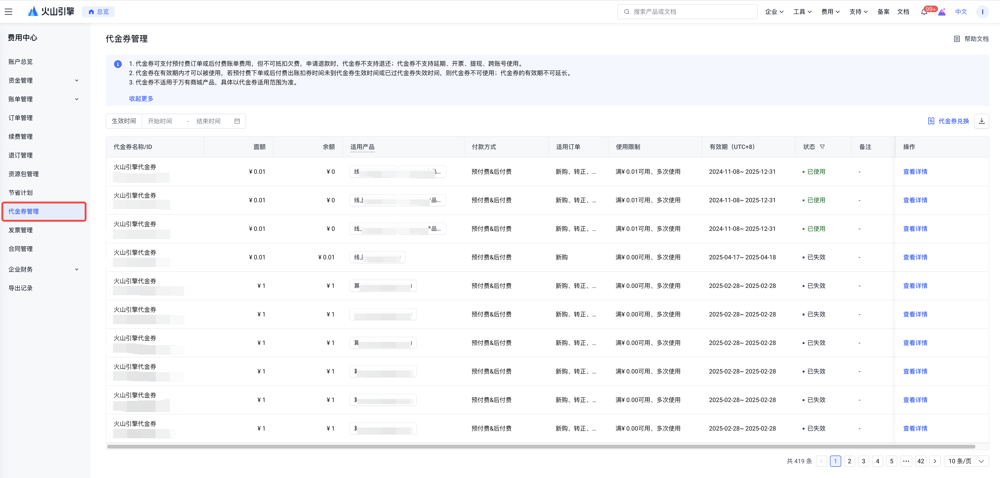
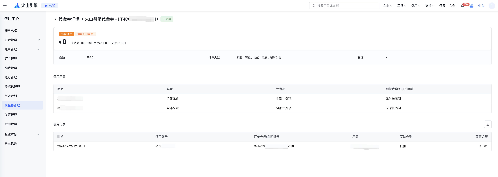
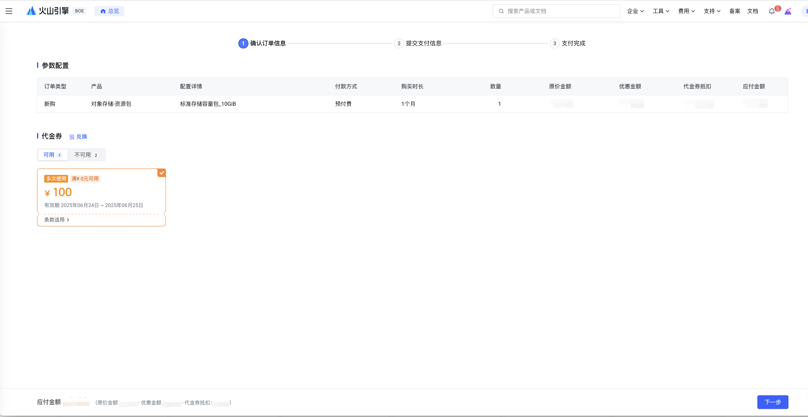
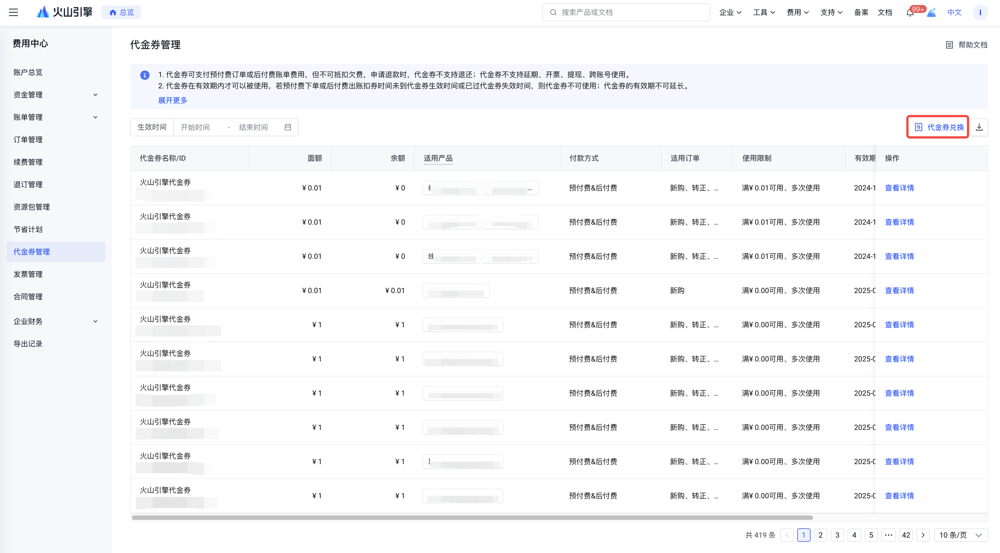
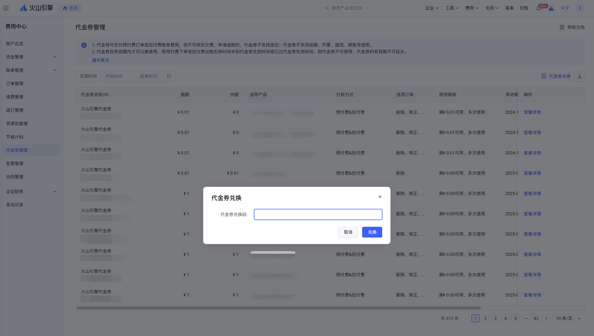
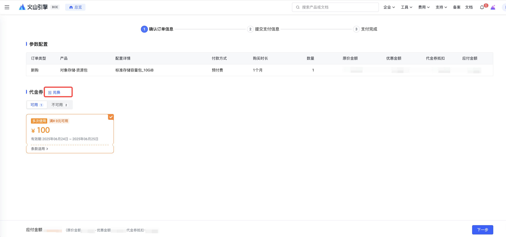

# 代金券管理

代金券是火山引擎平台发放给用户的一种账户资产，可用于抵扣预付费产品的订单金额和后付费产品的账单金额。用户可以通过登录火山引擎官网控制台，在【费用中心】>【[代金券管理](https://console.volcengine.com/finance/coupon)】页面中查看账户下的代金券情况。

代金券不可提现、转赠、开票、延期、跨账号使用、不支持抵扣欠费、代金券一经使用不支持退还。

## 代金券的查询

1. 登录火山引擎官网控制台，点击右上方的【费用中心】进入费用中心后台。
2. 点击左侧导航栏中的【代金券管理】菜单，即可进入代金券管理列表页面。
3. 可以在列表中直接查看每张代金券的名称、ID、面额、余额、适用产品、付费方式、适用订单类型、使用限制、有效期、状态等信息。也可以按代金券状态和生效时间进行搜索。

4. 点击操作列的"查看详情"，可查看该张代金券的详细使用记录。

## 代金券的使用

火山引擎平台发放的代金券目前已支持预付费订单和后付费账单进行使用。

对于预付费订单，在订单确认页面，系统会根据订单对应的产品、订单类型、订单金额等多种条件匹配可用的代金券进行展示，单笔订单只能使用一张代金券，当有多张可用代金券时，系统会根据优先级默认选中其中一张，用户可以根据自己的需要自行选择其他的可用代金券，也可以选择本次订单不使用代金券。如果代金券余额少于订单金额，需要使用现金/余额支付剩余部分。

对于后付费账单，在出账单扣款时，系统会根据账单中对应的产品、账单金额等多种条件匹配可用的代金券，当有多张可用代金券时，系统会根据优先级对可用代金券进行排序，然后按顺序进行抵扣，直到将账单金额抵扣完成或可用代金券余额消耗完毕。如果代金券余额仍少于账单金额，用户需要继续对剩余部分还款。

## 代金券的使用限制

### 1. 代金券状态

代金券状态分为未生效、生效中、已失效、已用完、已作废。

- **未生效**：未到代金券的生效日期，且余额＞0。
- **生效中**：处于代金券的有效期内，且余额＞0。
- **已失效**：超过代金券的有效期，且在有效期内时余额>0，或代金券限制单次使用且已被使用，符合任何一种情况都算。
- **已用完**：在代金券的有效期内余额用完。
- **已作废**：代金券被平台后台回收。

### 2. 适用产品范围

代金券适用于火山引擎官网中一个或多个产品配置，根据不同渠道或不同活动发放的代金券适用的产品范围有所不同，代金券实际适用的产品范围以代金券管理页面中展示的"适用产品"信息，或订单确认页面系统自动匹配到的可用代金券为准。

**1）商品：**
该代金券适用于指定商品产生的消费。

**2）配置：**
- **全部配置**：该代金券适用于可用商品下的全部配置产生的消费。
- **全部预付费配置**：该代金券适用于可用商品下的全部预付费配置产生的消费。
- **全部后付费配置**：该代金券适用于可用商品下的全部后付费配置产生的消费。
- **指定配置**（展示具体的配置名称）：该代金券适用于可用商品下的指定配置产生的消费。

**3）计费项：**
- **全部计费项**：该代金券适用于可用商品指定配置下的全部计费项产生的消费
- **指定计费项**（展示具体的计费项）：该代金券适用于可用商品指定配置下的指定计费项产生的消费。

### 3. 预付费限购时长

在有效期内，限制每次购买、更配或续费的时长。例如：对于包月计费方式的产品配置，代金券限购时长为 0 ~ 6 月可用，则每次下单时，订单购买时长需在 0 ~ 6 个月的时间范围内才可以使用该代金券。

包天/包月/包年等不同计费方式的限购时长是独立的，不可相互换算。例如：代金券限购时长为：包月 0 ~ 6 月可用&包年 0 ~ 1 年可用，当购买包月计费方式的产品配置时，系统会匹配包月的限购时长，即购买12个月时，不在 0 ~ 6 月可用的范围，则不可使用该代金券。

### 4. 适用订单类型

对于预付费订单来说，代金券适用于"新购""转正""更配""续费""临时升配"中的一种或多种订单类型，根据不同渠道或不同活动发放的代金券适用的订单类型有所不同，代金券实际适用的订单类型以代金券管理页面中展示的"适用订单"信息，或订单确认页面系统自动匹配到的可用代金券为准。

### 5. 金额使用门槛

仅针对单次支付，订单或账单费用满XX元可使用该代金券进行抵扣。

### 6. 有效期

代金券在有效期内才可以被使用，若预付费下单或后付费出账时代金券还未生效，请耐心等待代金券生效后再使用。若预付费下单或后付费出账时代金券已失效，则无法继续使用。代金券的有效期不可延长。

### 7. 使用次数

根据不同的使用次数设置，可分为单次使用代金券和多次使用代金券。

- **单次使用**：代金券仅可使用一次，使用一次后若余额>0，则状态变更为"已失效"，若余额=0，则状态变更为"已用完"，无论是否还有余额都不能再次使用。
- **多次使用**：代金券可多次使用，直到有效期过期或余额使用完毕后才不可使用。

### 8. 指定适用账号

当您的账号是财务托管主账号，商务为您发放代金券时可指定适用账号范围。

- 不限制适用账号范围，代金券页面不会展示"指定适用账号"部分，此时表示财务托管主账号及其全量托管子账号均可共享使用该代金券。
- 限制适用账号范围，代金券页面会展示"指定适用账号"字段，此时表示仅限"指定适用账号"中的账号ID可使用该代金券。
  - 若"指定适用账号"为托管主账号，表示仅托管主账号自己下单/出账时可使用该代金券。
  - 若"指定适用账号"为托管子账号，表示仅指定的托管子账号在托管期间下单/出账时可使用该代金券，解除托管关系后指定的托管子账号不再可使用该代金券。

### 9. 代金券抵扣规则判断优先级

为提高支付成功率，代金券抵扣规则将按照以下顺序逐级判断使用优先级，条件相同时进入下一层判断：

1. 可抵扣金额大的 > 可抵扣金额小的：优先使用可抵扣金额多的代金券；
2. 距失效时间近的 > 距失效时间远的： 优先使用即将到期的代金券；
3. 多次使用 > 单次使用： 优先使用"多次使用"的代金券；
4. 代金券余额小的 > 代金券余额大的： 优先使用余额小的代金券；
5. 适用范围窄的 > 适用范围广的： 优先使用适用产品范围窄的代金券；
6. 金额限制额度大的 > 金额限制额度小的： 优先使用金额限制大（满X元可用）的代金券；
7. 指定适用账号限制少的 > 指定适用账号限制多的：优先使用指定适用账号数量少的代金券；
8. 如上述判断后仍无法比较部分代金券的优先级，预付费场景，系统随机优先展示条件相同的代金券；后付费和自动续费场景，系统将条件相同的代金券中随机抵扣；

## 代金券的获取和兑换

### 1. 获取方式

通常可以通过以下途径获取代金券：

- 通过火山引擎官网活动页面获取代金券，不同促销活动发放的代金券有所区别，具体活动信息请关注火山引擎官网。
- 通过其他途径获取的兑换码兑换成代金券，详情请查看下文中的代金券兑换流程。

### 2. 兑换流程

1. 登录火山引擎官网控制台，在【费用中心】>【代金券管理】页面中，点击列表右上角的【代金券兑换】，在弹出的窗口中输入代金券兑换码后点击【兑换】按钮即可完成兑换。

2. 购买火山引擎产品时，在订单确认页面中，点击右侧的【代金券兑换】，在弹出的窗口中输入代金券兑换码后点击【兑换】按钮即可完成兑换。

---
最近更新时间：2025.10.15 11:34:09
