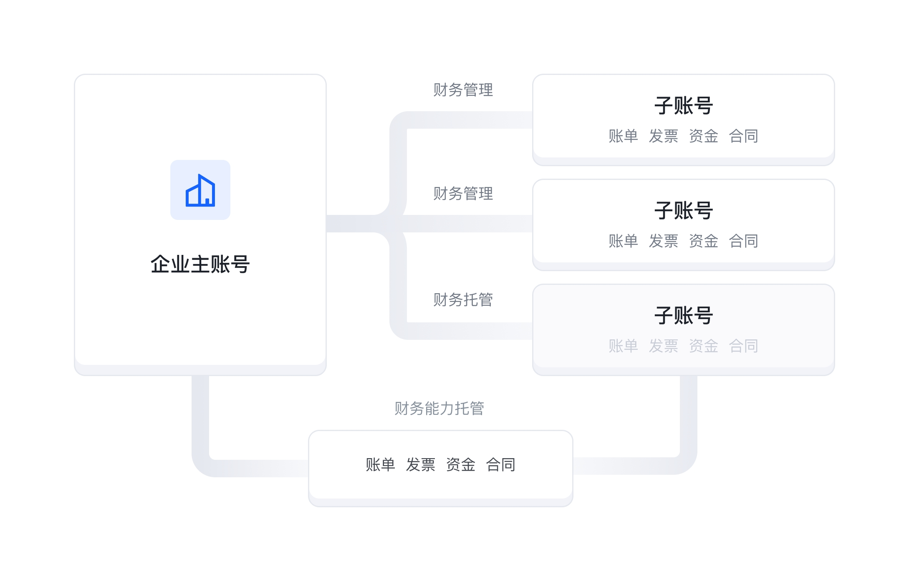

# 企业财务管理概述

## 1、功能说明

企业财务管理是火山引擎对多账号的企业客户，提供的云上跨账号的商务、履约(资金、发票、账单)一体化管理的解决方案。企业将所属多个账号进行关联管理，以企业视角统筹规划云上资源使用和履约管理，对关联账号的合同、优惠、卡券、账单、资金、发票进行集中化管理，完成统一出账、统一支付\结算、统一开票、集中资金管理等业务，并通过用量共享、优惠共享等方式优化企业的费用支出。

## 2、业务模式

企业财务管理支持财务托管和财务管理两种模式。

**财务托管模式：**
在财务托管模式下，子账号作为云上资源的使用账号。在开通\订购资源过程中，可根据主账号代金券的配置共享其代金券，并遵循主账号的合同优惠。子账号开通\订购资源产生的费用，均出具在主账号下。由主账号统一进行支付、开票、结算等履约业务管理。

**财务管理模式：**
在财务管理模式下，主子账号作为独立结算的账号，账户余额各自独立使用。在开通\订购资源过程中，可授权子账号共享主账号的合同优惠。主账号可授权查看子账号下的资金余额、账单信息、对子账号进行授信的划拨和回收、可授权协助子账号进行发票管理。

## 3、概念和术语

主账号、子账号在建立财务关系前均为官网的普通账号。在建立财务关系后，形成财务主账号和财务子账号，才有主账号、子账号的区分。

**主账号**
在多账号的企业客户中，用来管理其它关联账号商务过程和业务履约的账号。主账号作为履约账号，可统筹管理关联子账号下的优惠、消费、账单、发票、资金。通过共享服务、统一履约，实现企业级的商务活动、往来结算。主账号可创建关联子账号，亦可邀约其它账号为其下的关联子账号。

**子账号**
在多账号的企业客户中，被主账号创建出来的关联账号，或被邀约关联的账号。子账号的商务活动、合同优惠、账票款的履约托管于主账号或授权被主账号管理。

**关联关系**
主账号邀请子账号建立关联 或 主帐号直接创建具有关联关系的子账号。这种主子账号之间的业务关系叫做关联关系。

---
最近更新时间：2024.10.15 15:52:12
