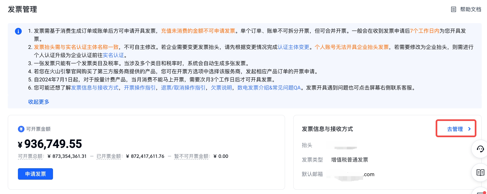
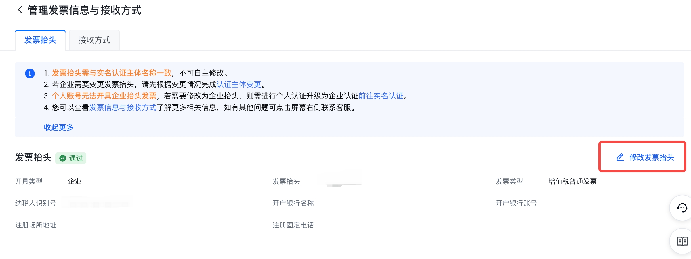
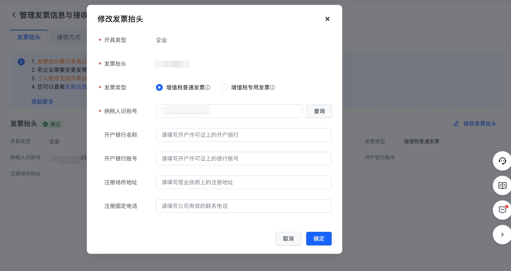
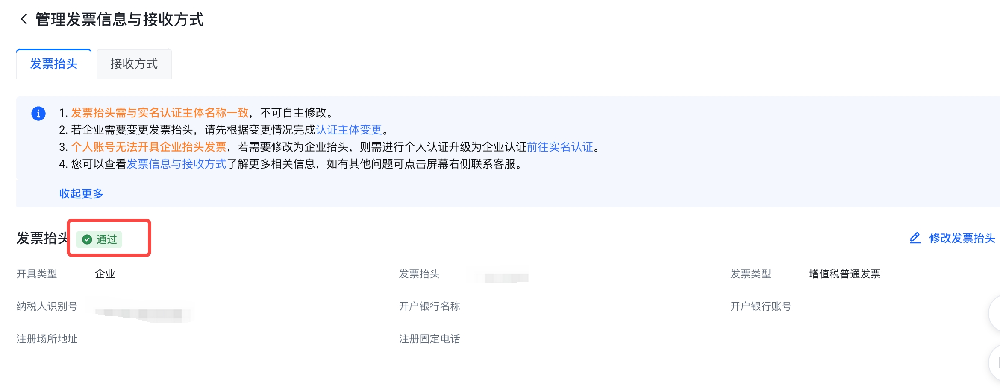
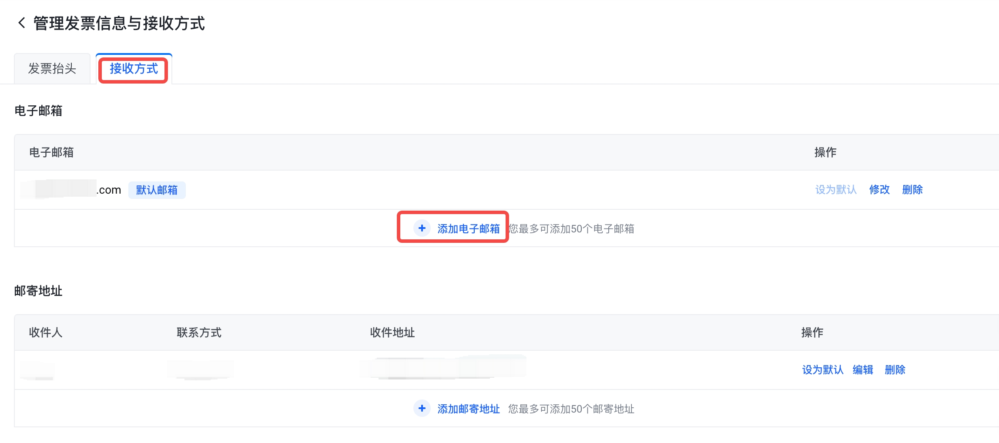
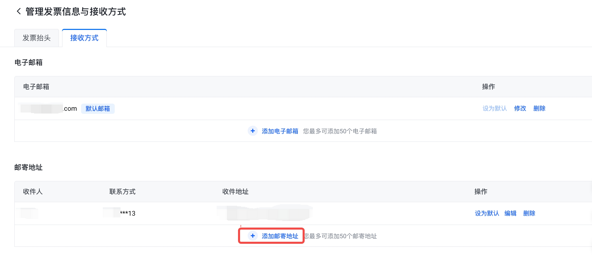

# 发票信息与接收方式

## 操作场景

如果您需要变更发票信息（发票抬头，发票类型，企业注册信息）/发票接收方式（电子邮箱，邮寄地址），本文档将为您提供操作指引。

## 前提条件

在操作发票信息修改前，请确认是企业抬头还是个人抬头，确认后可参考以下流程操作。
提前准备好发票抬头，发票电子邮箱/邮寄地址等信息。

## 操作流程

### 1.发票信息

#### 企业实名认证账号修改发票信息

1）登录**火山引擎控制台**，进入**费用-发票管理**，找到**发票信息与接收方式**，点击**去管理**，即可填写发票信息。

2）进入**发票抬头**页面（此处的"发票抬头"为发票信息统称），页面信息包含开具类型，发票抬头，发票类型，纳税人识别号和企业注册信息。

3）点击**修改发票抬头**（此处的"发票抬头"为发票信息统称），可以修改当前的***发票类型***，***纳税人识别号***和***企业注册信息***。

4）进入具体的编辑页面。

- **开具类型**：与客户实名认证类型一致，分为个人或企业，不可修改。
- **发票抬头**（此处的"发票抬头"仅指企业名称）：与客户实名认证主体名称一致，不可修改。
- **发票类型**：有"增值税普通发票"和"增值税专用发票"两种类型，个人用户仅可开具增值税普通发票，企业用户请与贵公司财务人员确认企业的纳税性质后再选择适合的发票类型。
- **纳税人识别号**：税务登记证上的号码，可根据实名认证主体名称查询。
- **开户银行名称、开户银行账号、注册场所地址、注册固定电话**：发票类型不同，必填的字段不同，根据实际情况填写即可。

> **注意**
> 管理发票信息前，需先完成账号实名认证。如账号未认证或处于认证流程中（含实名认证变更中），均无法修改发票信息。

5）提交发票信息。
系统后台会有专员在您提交后的**2个工作日内**完成审核。如下截图所示，如果状态为**通过**，则说明此发票信息审核通过，为有效状态，可用于申请发票。若发票信息状态为**拒绝**，说明此发票信息不可用，需按要求重新填写后提交审核。

#### 个人实名认证账号修改发票信息

如您当前维护的抬头是个人，不可修改发票抬头信息。若需要修改为企业抬头，则需完成企业实名认证[前往实名认证](https://console.volcengine.com/user/authentication/)。

### 2.发票接收方式

登录**火山引擎控制台**，进入**费用-发票管理**，找到**发票信息与接收方式**，点击**去管理**，即可填写发票接收方式。目前发票接收方式有两种：电子邮箱和邮寄地址。数电发票和电子发票可以通过电子邮箱发送，纸质发票可以通过邮寄地址发送。

#### 电子邮箱

点击**添加电子邮箱**，即可添加新的电子邮箱。您最多可以添加50个电子邮箱。

您可以点击**设为默认**将该邮箱设置为默认邮箱，默认邮箱会在开具发票时作为默认发送发票的电子邮箱。您也可以点击**修改/删除**，对目前已经存在的电子邮箱进行修改和删除操作。

#### 邮寄地址

点击**添加邮寄地址**，即可添加新的邮寄地址。您最多可以添加50个邮寄地址。

您可以点击**设为默认**将该地址设置为默认地址，默认地址会在开具发票时作为默认发送发票的邮寄地址。您也可以点击**修改/删除**，对目前已经存在的邮寄地址进行修改和删除操作。

---
最近更新时间：2024.07.11 17:55:14
