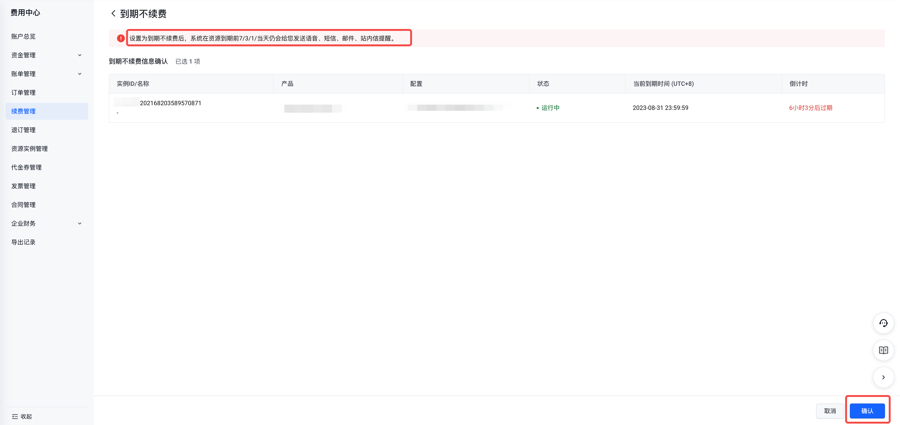
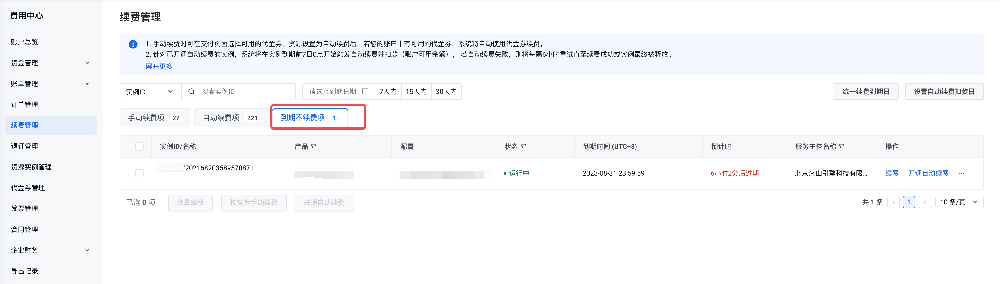
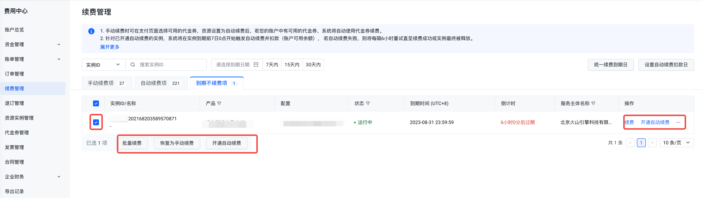

# 到期不续费

## 规则说明

- 客户可为到期不再使用的实例设置到期不续费，归置到"到期不续费项"页签。
- 已设置为"到期不续费"的实例在到期后将进入保留期，保留期期间服务会被关停导致无法正常使用，资源和数据均会保留，若需要继续使用服务，请及时发起手动续费，保留期到期后实例将被自动释放。
- 已到期实例不支持修改续费类型为到期不续费。
- 已设置为"到期不续费"的"运行中"实例可进行批量续费、手动续费、恢复为手动续费、开通自动续费操作，状态为"已过期"的实例仅支持批量续费、手动续费、恢复为手动续费。
- 针对到期不续费的实例，到期预警、到期关停、到期回收的消息通知将在到期前7/3/1/当日分别发送语音、短信、邮件、站内信通知，请注意关注。

## 操作步骤

1. 进入"费用中心-续费管理-手动续费/自动续费"页签，选择待设置到期不续费的实例，单击操作列"到期不续费"或页面下方批量"到期不续费"按钮。

2. 进入"到期不续费"页面，单击"确认"，即设置成功

3. 设置"到期不续费"成功后，可在"费用中心-续费管理-到期不续费"页签查看对应实例。

4. 到期不续费实例可根据实际情况进行手动续费操作，点击"续费"或"批量续费"后，进入到续费信息确认页面，设置续费时长，点击"去支付"，完成续费订单支付，即续费成功。

5. 到期不续费实例可根据实际情况对单个实例或多个实例进行恢复为手动续费、开通自动续费（实例到期前）操作，操作成功后，实例将自动归置到"手动续费项"或"自动续费项"页签。

---
最近更新时间：2023.09.01 18:51:51
