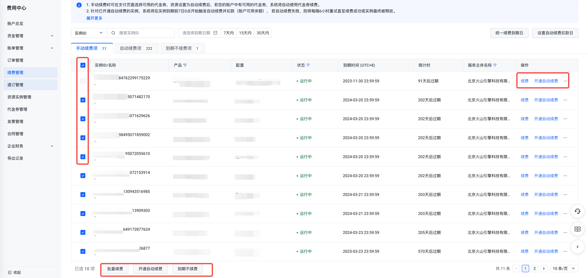
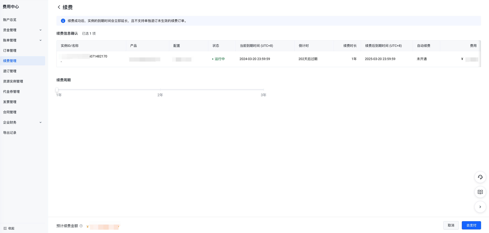

# 手动续费规则说明

## 规则说明

- 已设置为"手动续费"且状态为"运行中"的包年包月实例可进行手动续费、批量续费、开通自动续费、到期不续费操作，状态为"即将关停/已关停/退款停机"的包年包月实例仅支持手动续费、批量续费操作。
- 已设置为"手动续费"且状态为"运行中"的预留实例券可进行批量续费、手动续费、开通自动续费、到期不续费操作，已到期的预留实例券将不支持续费操作。
- 手动续费时可在订单信息确认页选择可用的代金劵。
- 具有强绑定关系的资源实例必须同时续费（如云服务器和系统盘），具有弱绑定关系的资源实例可在续费时选择是否要随其他实例一起续费（如绑定云服务器的公网IP）。
- 处于临时升配期间的实例，手动续费时系统将按照临时升配前的原配置进行计算续费费用并延长实例最终的到期时间。

### 续费列表实例状态说明

| 状态 | 说明 |
| --- | --- |
| 运行中 | 实例在到期前均为运行中 |
| 即将关停 | 实例已到期但未关停 |
| 已关停 | 实例已被到期关停 |
| 退款停机 | 部分产品的实例在退订后支持保留期，在保留期内仅支持通过手动续费将资源恢复。 |

## 操作步骤

1. 进入"费用中心-续费管理-手动续费"页签。
2. 根据实际情况可续费单个实例或批量续费实例。

3. 进入到续费信息确认页面，设置续费时长，点击"去支付"，完成续费订单支付，即续费成功。

4. 根据实际情况还可对单个实例或多个实例开通自动续费（实例到期前）、到期不续费（实例到期前）操作，操作成功后，实例将自动归置到"自动续费项"或"到期不续费项"页签。

---
最近更新时间：2023.09.01 18:51:27
