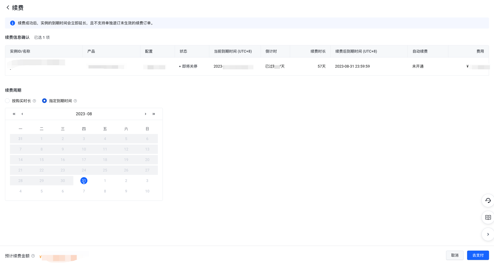

# 指定到期时间

## 规则说明

指定到期时间是指通过续费将包月（非自然月）实例的到期时间完全统一，即年月日均一致。

**注意事项**

- 指定到期时间的最小日期为续费实例中的最长到期时间+1个月后的日期（23:59:59）。
- 指定到期时间后，续费的计费时长精确到天，将包月的价格折算到天，具体续费金额请以订单信息确认页为准。
- 仅非自然月包月的实例在手动续费时指定到期时间，包年/包天/自然月包月的实例暂不支持此功能。
- 仅支持在手动续费时指定到期时间，自动续费仍按照预置的单次续费周期进行执行自动续费。
- 续费指定到期时间计算规则：根据续费天数按照30天换算成月。

**示例**

实例A的到期日为2023年08月28日23:59:59，实例A包月刊例价为60元/月且无折。实例B的到期日为2023年09月12日23:59:59，实例B包月刊例价为30元/月且无折扣。若客户在2023年08月27日发起手动续费，则指定到期时间的最小日期将为2023年10月12日23:59:59。若客户指定到期时间为2023年10月30日23:59:59，则实例A的续费时长为63天，续费金额=60元/30*63天=126元；实例B的续费时长为48天，续费金额=60元/30*48天=96元。

## 操作步骤

1. 选择待续费实例，点击"续费"或"批量续费"。
2. 点击"指定到期时间"按钮，并选择续费至具体日期。

3. 点击"去支付"并完成续费。

---
最近更新时间：2024.12.12 20:14:23
