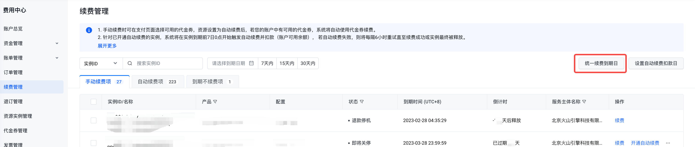
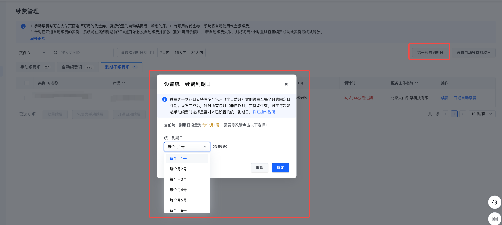
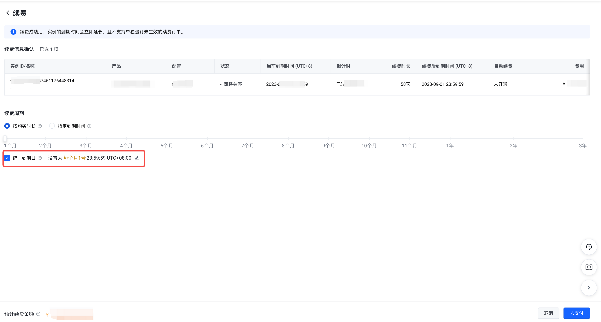

# 统一到期日

### 规则说明

续费统一到期日支持将多个包月（非自然月）实例续费至每个月的固定日到期。设置完成后，针对所有包月（非自然月）实例均生效，可在每次发起手动续费时选择是否对齐已设置的统一到期日。

**注意事项**

- 若客户从未设置过统一到期日时，在设置统一到期日页面默认统一到期日为每月的1号23:59:59。
- 统一到期日只支持设置为每个月1~28号及每个月最后一天。
- 最终续费生效的统一到期日与当前计费周期到期日之间的间隔不能少于1个月。续费到统一到期日后，续费的计费时长精确到天，将包月的价格折算到天，具体续费金额请以订单信息确认页为准。
- 仅非自然月包月的实例在手动续费时统一到期日，包年/包天/自然月包月的实例暂不支持此功能。
- 仅支持在手动续费时选择统一到期日，自动续费仍按照预置的单次续费周期进行执行自动续费。
- 续费统一到期日计算规则：根据续费天数按照30天换算成月。

**示例** 实例A的到期日为2023年08月28日23:59:59，实例A包月刊例价为60元/月且无折扣，客户设置统一到期日为每个月15号，则：

- 客户在2023年08月27日发起手动续费，续费时长为一个月且在续费时没有勾选统一到期日，则续费后到期时间为2023年09月28日23:59:59，续费金额=60元*1个月=60元。
- 客户在2023年08月27日发起手动续费，续费时长为一个月且勾选统一到期日（已设置为每个月15号），则续费后到期时间为2023年10月15日23:59:59，续费时长为48天，续费金额=60元/30*48天=96元。

### 操作步骤

1. 进入"续费管理"页面，单击续费列表右上角"统一续费到期日"按钮。

2. 设置统一到期日

3. 点击"确定"完成设置。
4. 选择待续费实例，点击"续费"或"批量续费"。
5. 选择按购买时长续费并勾选"统一到期日"。

6. 点击"去支付"并完成续费。

---
最近更新时间：2024.12.12 20:14:28
