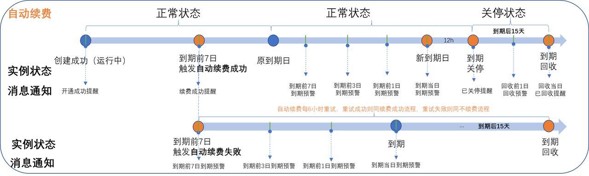

# 续费规则概览

包年包月资源开通成功后，客户可对该资源进行续费操作。火山引擎支持三种续费类型：手动续费（[统一到期日](统一到期日.md)）、自动续费（[自动续费扣款日](自动续费扣款日.md)）、到期不续费。

## 续费规则说明

1. 手动续费、自动续费、到期不续费在包年包月实例到期释放前均生效。
2. "运行中"的包年包月实例支持设置续费类型为手动续费、自动续费、到期不续费，"即将关停/已关停/退款停机"的包年包月实例仅支持恢复为手动续费。
3. "运行中"的预留实例券支持到期前进行手动续费、自动续费、到期不续费，"即将关停/已关停/退款停机"的预留实例券不支持续费。
4. 状态为"退款停机"的实例，在退订后自动续费将失效，在最终释放前仅支持手动续费。
5. 具有强绑定关系的资源实例必须同时续费（如云服务器和系统盘），具有弱绑定关系的资源实例可在续费时选择是否要随其他实例一起续费（如绑定云服务器的公网IP）。
6. 处于临时升配期间的实例，续费时系统将按照临时升配前的原配置进行计算续费费用并延长实例最终的到期时间。
7. 全预付节省计划续费时，不支持使用信控，请保证信控外的可用额度充足，避免续费失败
8. 续费列表实例状态说明

| 状态 | 说明 |
|------|------|
| 运行中 | 实例在到期前均为运行中 |
| 即将关停 | 实例已到期但未关停 |
| 已关停 | 实例已被到期关停 |
| 退款停机 | 部分产品的实例在退订后支持保留期，在保留期内仅支持通过手动续费将资源恢复。 |

## 续费限制说明

1. 按需资源、竞价实例、递减型资源包、一次性资源、预留块存储容量包不支持续费。
2. 处于变更中的资源不允许续费（如更配中、续费中、退订中等）。
3. 已释放的资源不支持续费。
4. 已下架的产品不支持续费。

## 续费详细图示说明（以包年包月云资源为例）

1. 包年包月云资源实例生命周期：实例到期或退订回收前均可手动续费。

2. 包年包月云资源实例自动续费：默认到期前7日0点开始触发自动续费（可自定义设置自动续费扣款日），若自动续费失败，则每6小时重试，直至续费成功或实例最终被释放。

3. 到期相关通知说明

- a. 到期前预警：实例到期前7/3/1/当日均默认发送短信、邮件、站内信通知，至少在到期前3天发送一次语音通知（根据历史消费情况可能会增加语音通知次数），您可以前往[消息中心](https://console.volcengine.com/message/setting)设置【产品到期预警】的接收人和接收渠道。
- b. 到期关停通知：实例在到期关停后，会默认发送语音、短信、邮件、站内信通知，您可以前往[消息中心](https://console.volcengine.com/message/setting)设置【产品关停提醒】的接收人和接收渠道。
- c. 到期回收前预警：实例在到期回收前1天后，会默认发送短信、邮件、站内信通知，也可以主动订阅语音通知，您可以前往[消息中心](https://console.volcengine.com/message/setting)设置【产品释放通知】的接收人和接收渠道。
- d. 到期回收通知：实例在到期回收后，会默认发送短信、邮件、站内信通知，也可以主动订阅语音通知，您可以前往[消息中心](https://console.volcengine.com/message/setting)设置【产品释放通知】的接收人和接收渠道。
- e. 以上消息均支持设置通过自定义的飞书机器人发送至飞书，您可以前往[消息中心](https://console.volcengine.com/message/setting)进行相关设置。

## 支持续费的产品

| 产品线 | 产品名称 |
|--------|----------|
| 云基础 | 云服务器、镜像服务、公网IP、负载均衡、NAT网关、VPN连接、云企业网、专线连接、弹性块存储、云数据库 MySQL 版、云数据库 PostgreSQL 版、缓存数据库 Redis 版、文档数据库 MongoDB 版、消息队列 RabbitMQ版、消息队列 RocketMQ版、消息队列 Kafka版、文件存储 NAS 极速版、云搜索服务、Web应用防火墙、云堡垒机、安全托管服务、云加密机、云解析DNS、云调度 GTM、中转路由器 |
| 视频与内容分发 | 视频直播、实时音视频、视频点播、直播SDK、边缘计算节点、全站加速、多云CDN、云手机、云游戏、号码隐私保护 |
| 数智平台VeDI | 客户数据平台-SaaS、客户数据平台-Volc、增长营销平台-SaaS、智能数据洞察-SaaS、智能数据洞察-SaaS-Cloud、大数据研发治理套件、全域数据集成、ByteHouse企业版、E-MapReduce |
| 智能应用 | 机器学习平台、智能推荐平台-SaaS、智能创意、智能外呼、业务风险识别、银行卡识别、身份证识别、通用实体识别、通用文字识别、商品识别、视频场景识别、天空分割、商品图像分割、通用图像分割、视频人脸融合、人像年龄变换、人像抠图、人像漫画、人像融合、图像增强、图片超分辨率、图片方向矫正、图片Logo遮罩、图片裁剪、图片智能填充、老照片修复、语音合成、多语种OCR、字节跳动大模型服务（豆包大模型）、开源LLM模型 |
| 其他 | 持续交付、飞连公有云版、veMARS-SaaS |

---
最近更新时间：2025.11.28 17:59:51
