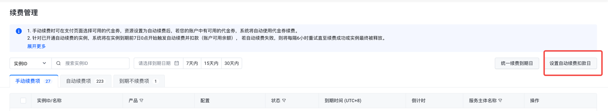
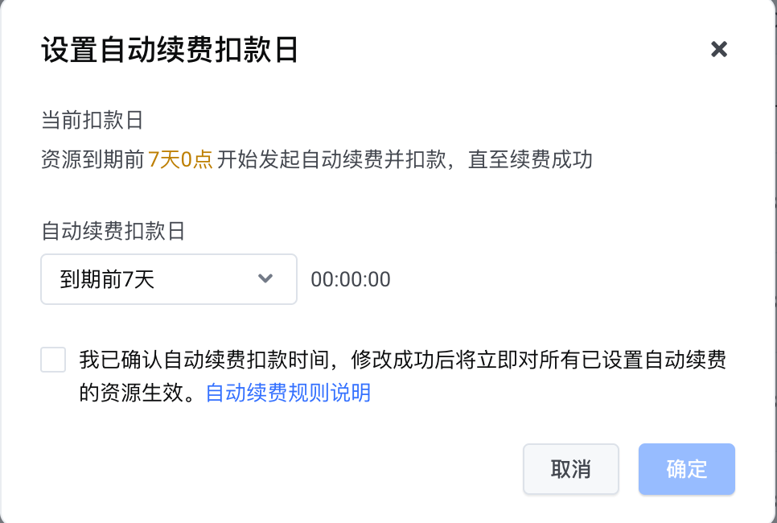
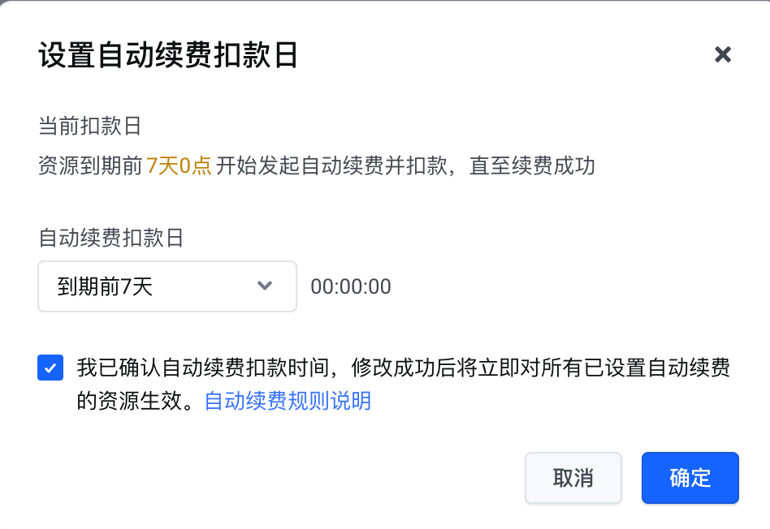

# 自动续费扣款日

## 规则说明

- 针对已开通自动续费的资源，客户可自定义设置自动续费扣款日，系统将按设置后的自动续费扣款日开始扣款，请确保资金余额充足。
- 若未设置自动续费扣款日，则系统将默认在资源到期前的第7天0点开始执行自动续费；若已设置自动续费扣款日，则系统将根据客户自定义设置的扣款日0点开始执行自动续费。
- 自动续费扣款日修改成功后，该时间点后的自动续费定时任务将以新的扣款日生效。

## 操作步骤

1. 进入"续费管理"页面，单击续费列表右上角"设置自动续费扣款日"按钮。

2. 设置自动续费扣款日，可选择到期前7天～到期当天（00:00:00）。

3. 勾选自动续费扣款日须知，点击"确定"完成设置。

---
最近更新时间：2024.11.25 15:05:18
