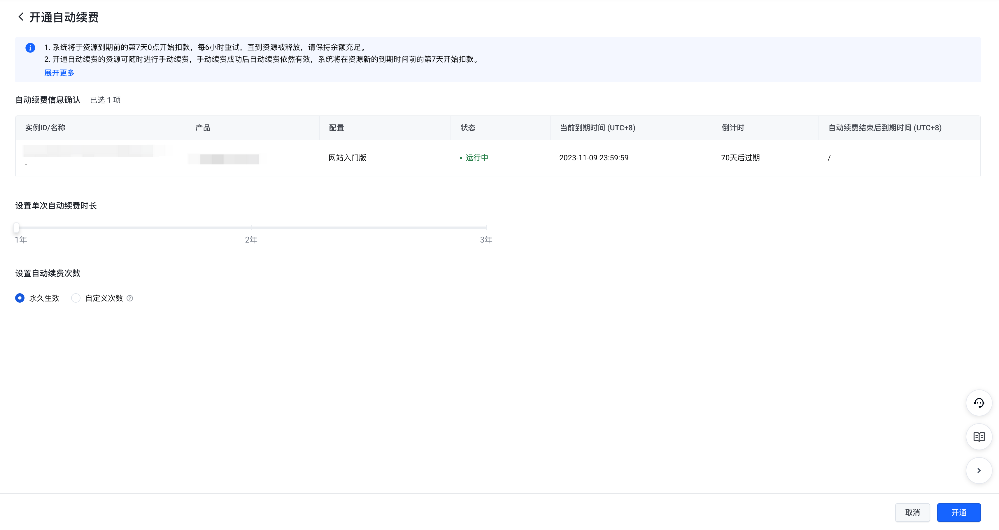
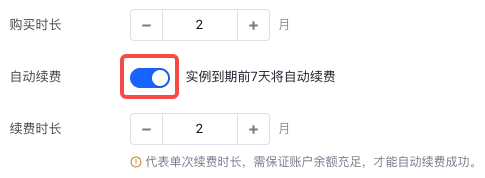
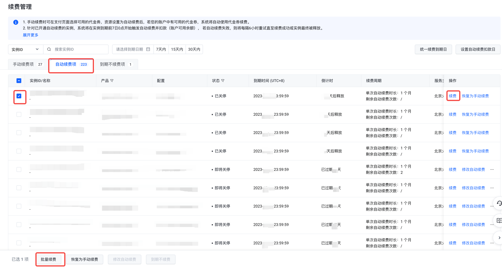
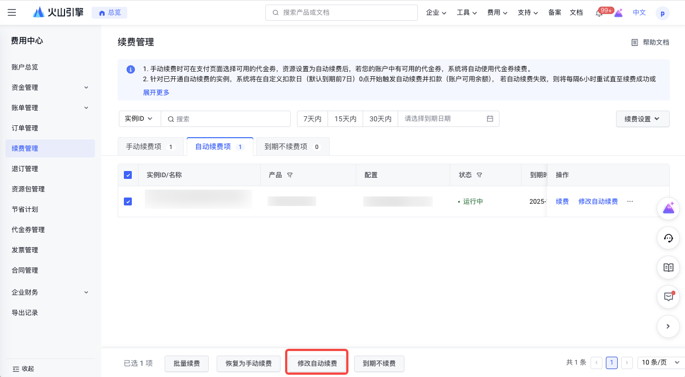
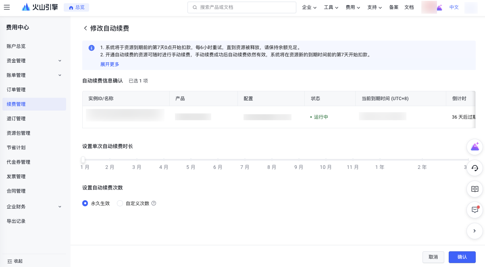
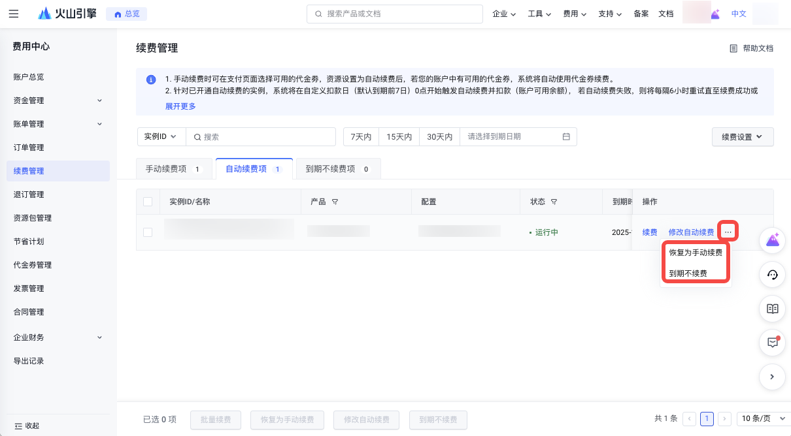
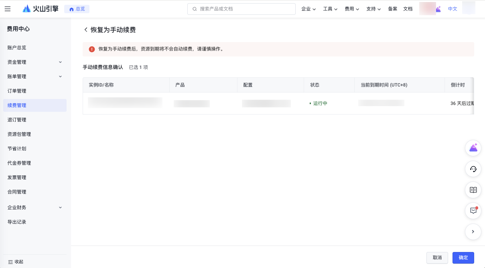
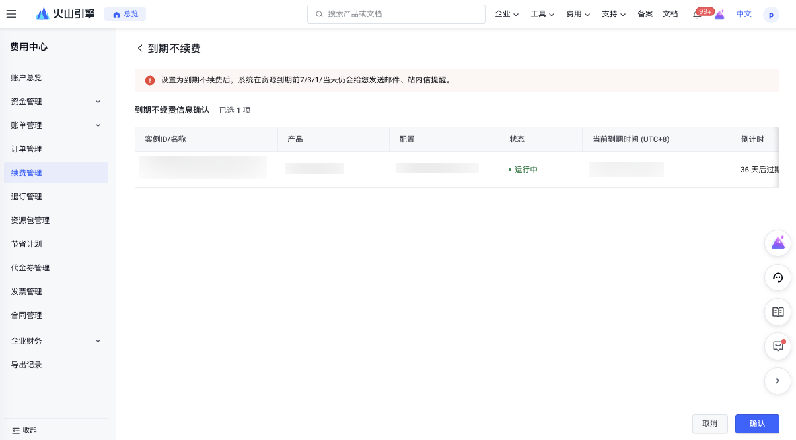

# 自动续费规则说明

## 规则说明

1. 为防止实例到期关停影响使用，客户可在实例到期前开通或修改自动续费功能，已设置为"自动续费项"的实例将归置到"自动续费"页签。
2. 已设置为"自动续费"且状态为"运行中"的实例支持手动续费、批量续费、恢复为手动续费、修改自动续费、到期不续费操作。
3. 已设置为"自动续费"且状态为"即将关停/已关停"的实例仅支持手动续费、批量续费、恢复为手动续费操作。
4. 已设置为"自动续费"且状态为"退款停机"的实例自动续费将失效，并归置到"手动续费"页签，即仅支持手动续费。
5. 开通自动续费后，若未设置自动续费扣款日，则系统将默认在资源到期前的第7天0点开始扣款，每6小时重试，直到资源被最终释放（到期回收），请保持余额充足。若已设置自动续费扣款日，则系统将根据已设置的扣款日0点开始执行自动续费，每6小时重试，直到资源被最终释放（到期回收）。
6. 开通自动续费的资源可随时进行手动续费，手动续费成功后自动续费依然有效。
7. 自动续费时，若您的账户中有可用的代金券，系统将自动使用您账户下可用的代金券。
8. 全预付节省计划续费时，不支持使用信控，请保证信控外的可用额度充足，避免续费失败
9. 续费列表实例状态说明

| 状态 | 说明 |
| --- | --- |
| 运行中 | 实例在到期前均为运行中 |
| 即将关停 | 实例已到期但未关停 |
| 已关停 | 实例已被到期关停 |
| 退款停机 | 部分产品的实例在退订后支持保留期，在保留期内仅支持通过手动续费将资源恢复。 |

## 操作步骤

### 1. 开通自动续费

**方式一：费用中心开通自动续费**

1. 进入"费用中心-续费管理-手动续费/到期不续费"页签，选择实例后点击"开通自动续费"。
2. 设置单次自动续费时长和自动续费次数，自动续费次数默认选择永久生效，也可自定义设置次数，自定义次数用完后将变更为手动续费。
3. 点击"开通"设置完成。

**方式二：选购下单时开通自动续费**

1. 选购下单时，选择"连续包年/连续包月"模式，可开通自动续费。若选择"连续包年"，续费周期为1年；"连续包月"，续费周期为1个月。当提交订单并完成支付时，即成功开启自动续费。

2. 选购下单时，开启自动续费并选择续费时长，在提交订单并完成支付后，即成功开启自动续费。

### 2. 自动续费实例进行手动续费

1. 进入"费用中心-续费管理-自动续费"页签。
2. 选择实例，点击"续费"或"批量续费"后，进入到续费页面，设置续费时长，点击"去支付"，完成续费订单支付，即手动续费成功。
3. 开通自动续费的资源也可随时进行手动续费，手动续费成功后自动续费依然有效，系统将在资源新的到期时间前的您设置的天数开始扣款（默认为到期前7天）。

### 3. 修改自动续费

1. 根据实际情况可对单个实例或多个实例进行修改自动续费（实例到期前），允许修改单次自动续费的时长和自动续费次数
2. 自动续费次数代表系统执行自动续费操作的次数，默认为永久生效，也可设置自定义次数，自定义次数用完后将变更为手动续费
3. 点击实例右侧"恢复为手动续费"按钮，或选择实例，点击列表下方"修改自动续费"按钮，操作成功后，下一次自动续费触发时按新规则执行

### 4. 取消自动续费

1. 点击实例右侧，或hover在...上点击"恢复为手动续费"按钮；或选择实例，点击表格下方"恢复为手动续费"按钮。在恢复手动续费页点击确定后，弹出恢复手动续费成功提示，即取消自动续费成功，您原设置的自动续费扣款日将不会再自动执行扣款。
2. 为避免您预期外的实例关停，请谨慎操作恢复为手动续费。

### 5. 设置到期不续费

1. 如果到期后不再期望续费，可以将实例设置为到期不续费（实例到期前）操作，操作成功后，实例将归入到期不续费页签内
2. 设置为到期不续费后，系统在资源到期前7/3/1/当天仍会给您发送邮件、站内信提醒

---
最近更新时间：2025.11.28 18:00:00
