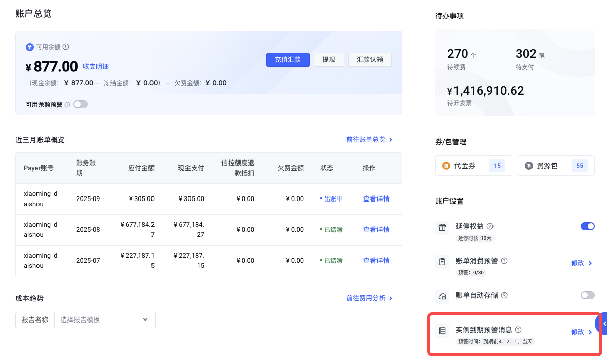
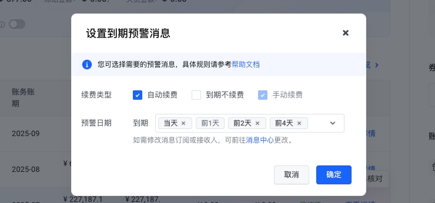

# 设置到期消息

## 什么是到期消息？

火山引擎消息中心提供了资源到期的提醒功能，到期消息通过站内信、邮箱、短信、语音来通知您的资源即将到期或已到期，及时操作续费、充值或重新购买，避免因忘记处理导致实例到期，而造成服务中断或资源被回收。预设的提醒时间如下（部分产品可能不涉及停机/释放）：

- **到期前预警**：默认在实例到期前7天、3天、1天、当天提醒。您也可以取消部分续费类型或日期的提醒。具体操作，请参考下文设置到期预警消息部分。
  - 已用完的一次性资源包、调整的预留实例券原券不发送到期预警
- **到期后通知**：预留实例券和预留块存储容量包，在实例到期次日提醒（包括调整到期和原券到期），无法修改。
- **到期关停后通知**：在实例到期当天提醒，无法修改。
- **到期回收前预警**：在实例到期回收前一天提醒，无法修改。
- **到期回收后通知**：在实例到期回收当天提醒，无法修改。
  - 一次性实例、预留实例券、预留块存储容量包不发送到期关停通知、到期回收预警和到期回收通知

## 设置到期预警消息

1. 登录火山引擎控制台[账户总览页](https://console.volcengine.com/finance/account-overview/)。

2. 在右边栏账户设置，点击实例到期预警消息的修改按钮。

3. 在设置到期预警消息弹窗中，您可以修改需要订阅的续费类型和日期

4. 为避免非预期关停带来损失，不允许单独取消手动续费实例的到期预警消息，到期前1天不允许取消选择

5. 修改后，点击确定完成设置

---
最近更新时间：2025.09.08 10:42:44
