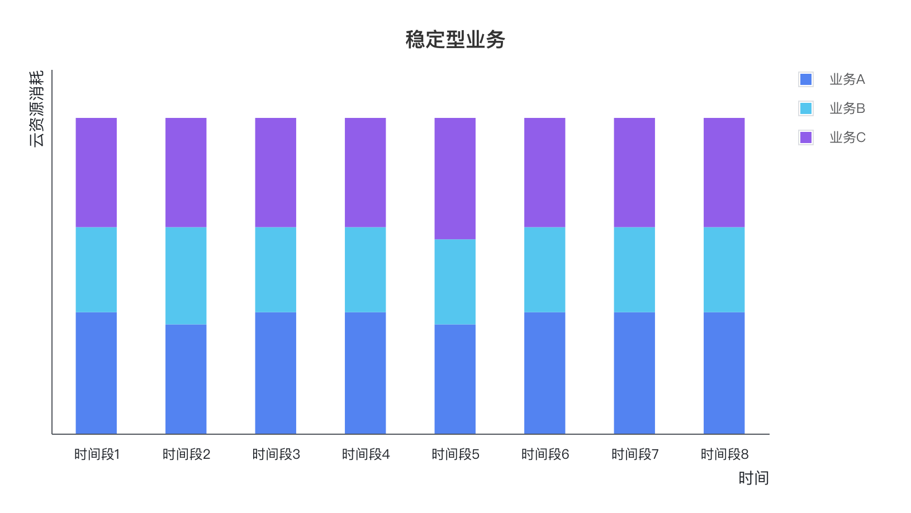
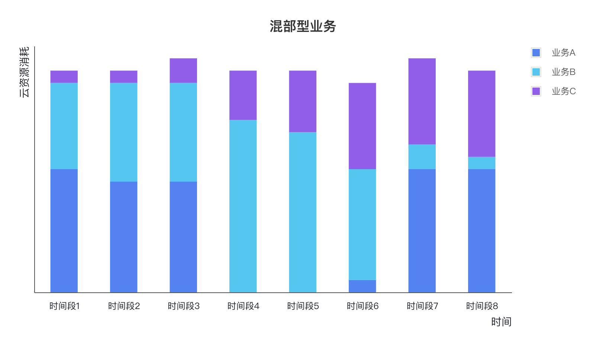
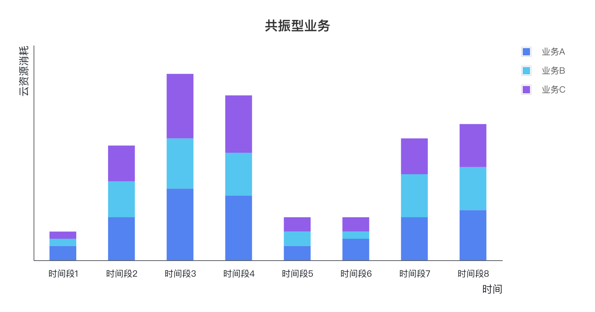
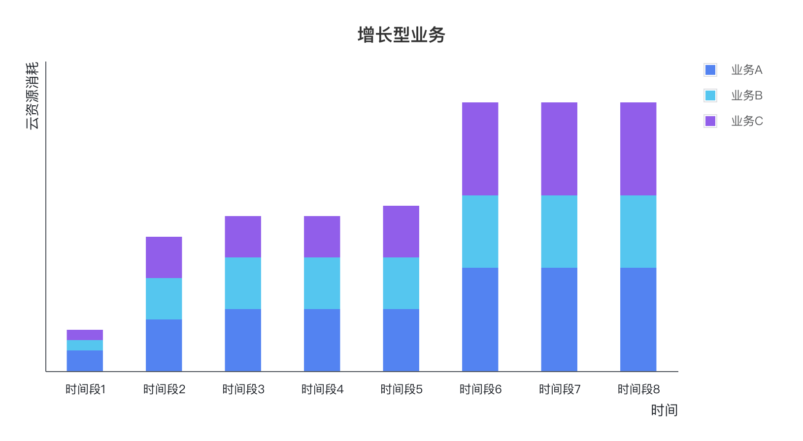
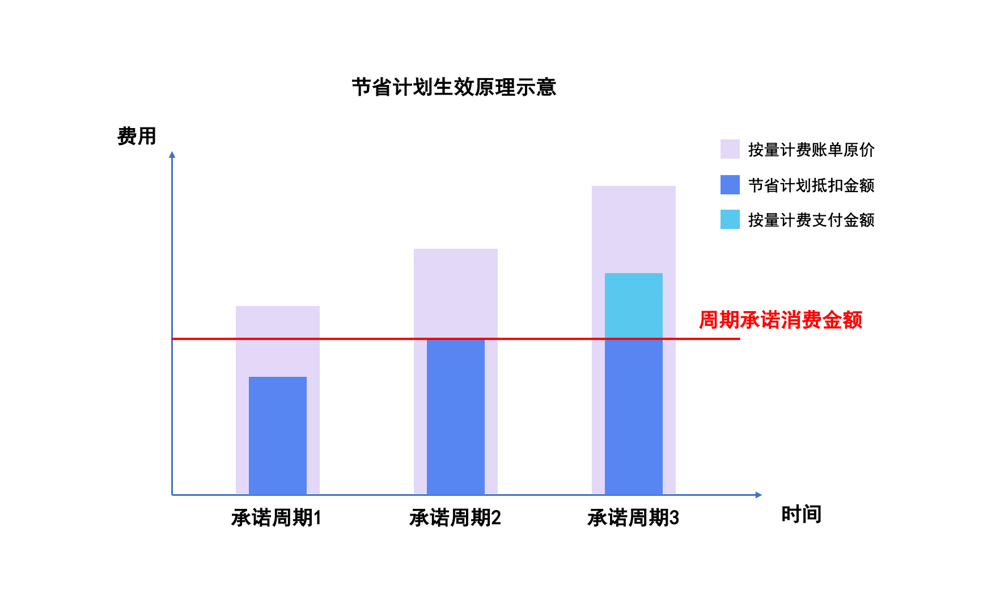
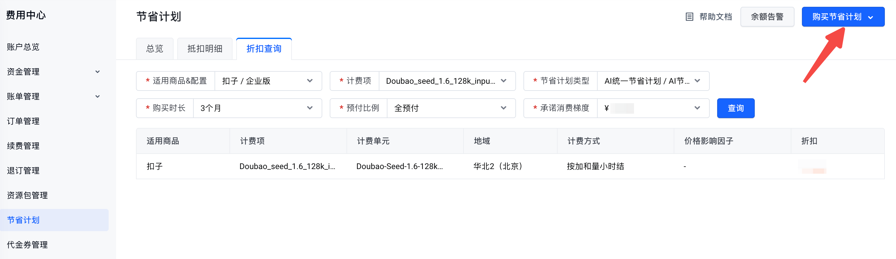

# 节省计划介绍

## 节省计划的定义

节省计划是火山引擎为客户提供的一种折扣权益计划。您可以通过预先承诺一定时间周期内的消费金额，换取后续以更低的折扣来抵扣按量计费账单消费。

节省计划本身不提供云服务资源，需要搭配按量计费实例使用。节省计划的承诺消费金额可以用于抵扣按量计费实例的消费，超出承诺的部分按量计费。

节省计划的承诺消费金额越高、购买时长越长、预付比例越高，抵扣按量计费账单时的折扣越低。

节省计划可以分为递减型、周期型两大类：

- **递减型节省计划**，整个有效期内的承诺消费金额固定，余量随着抵扣不断减少，直至余量抵扣完或者节省计划到期。
- **周期型节省计划**，每个承诺周期内的承诺消费金额固定，周期内余量随着抵扣不断减少，且不可转移到下个承诺周期；下个周期初承诺消费金额重置，直至节省计划到期。

## 节省计划的优势

- **节约成本**：搭配节省计划使用时可以获取更低的抵扣折扣，对比按量计费最高节省47%。
- **使用灵活**：相比于包年包月，节省计划可以抵扣不同的商品和实例，云资源使用上更加灵活。
- **付款灵活**：支持全预付、零预付的付款方式，支付更加灵活，缓解您的现金流压力。

## 适用场景

### 1、稳定型业务

指每个业务部门在不同时间段内，云资源消耗都相对稳定的业务形态。

建议您根据当前整体云资源消耗情况，购买对应额度的节省计划，从而降低整体用云成本。

### 2、混部型业务

指每个业务部门在不同时间段内有不同的用云诉求，但整体云资源消耗总量相对稳定的业务形态。

建议您根据当前整体云资源消耗情况，购买对应额度的节省计划，从而降低整体用云成本。

### 3、共振型业务

指各业务部门有弹性使用云资源诉求，并且在某些时间段云资源消耗会同步增长的业务形态。

建议稳定使用的云资源购买对应额度的节省计划，叠加按量计费模式满足弹性诉求，从而在满足业务弹性的同时降低整体用云成本。

### 4、增长型业务

指各业务部门的云资源消耗，随着时间持续增长的业务形态。

建议您根据每个时期的云资源消耗和业务规划，持续叠加购买节省计划，从而最大限度降低用云成本。

## 生效原理

节省计划有效期内的承诺消费金额，可以按节省计划折扣，抵扣按量计费账单的消费；按量计费账单未被抵扣完的部分，按照该云资源适用的其他折后价（如无可适用的其他折扣优惠，按照刊例价结算）进行出账。

以周期承诺的节省计划为例：

假设您每月承诺消费金额为1000元，某大模型M没有合同折扣，节省计划抵扣大模型M的折扣为8折，节省计划每个承诺周期最多可抵扣大模型M的按量计费消费1000/0.8=1250元。

在没有购买节省计划、和购买了节省计划的两种情况下，每个周期的费用情况如下表：

| 计费方式 | 第1个月承诺周期 | 第2个月承诺周期 | 第3个月承诺周期 |
|----------|-----------------|-----------------|-----------------|
| 没有购买节省计划，仅使用按量计费 | 大模型M按量计费账单消费金额：1000元。 您本周期实际支出为：按量计费1000元。 | 大模型M按量计费账单消费金额：1250元。 您本周期实际支出为：按量计费1250元。 | 大模型M按量计费账单消费金额：1500元。 您本周期实际支出为：按量计费1500元。 |
| 在按量计费的基础上，购买了节省计划 | 大模型M按量计费1000元<节省计划最大可抵扣金额1250元，因此按量计费账单能被完全抵扣。 按量计费账单金额：0元。 您本周期实际支出为：节省计划承诺消费金额1000元。 | 大模型M按量计费1250元=节省计划最大可抵扣金额1250元，因此按量计费账单能被完全抵扣。 按量计费账单金额：0元。 您本周期实际支出为：节省计划承诺消费金额1000元。 | 大模型M按量计费1500元>节省计划最大可抵扣金额1250元，因此按量计费账单不能被完全抵扣，超出的部分按量计费出账。 按量计费账单金额：250元。 您本周期实际支出为：节省计划承诺消费金额1000元 + 按量计费250元，一共1250元。 |

## 如何购买节省计划

您可前往[费用中心 - 节省计划](https://console.volcengine.com/finance/saving-plan?savingPlanTab=3)页面，查询节省计划抵扣不同计费项时的折扣，或者跳转到具体云产品对应的节省计划购买页面。

**注意：**

- 单个账号ID，最多可同时存在40个生效中的节省计划，达到上限时不可购买新的节省计划。
- 代销终端客户不支持购买节省计划。
- 代售终端客户不支持购买全预付的节省计划，仅支持购买零预付的节省计划。

## 节省计划退订政策

节省计划购买后不支持退订。

## 节省计划支付方式说明

节省计划支持全预付、零预付两种支付方式。

### 1、全预付

在您下单购买节省计划时，需要一次性付清全部费用，后续不再需要支付节省计划的费用。

全预付的节省计划，购买后立即生效，直到承诺消费金额抵扣完或者节省计划到期，不受欠费影响。

不支持使用信控额度支付（含新购、续费、自动续费）。

### 2、零预付

在您下单购买节省计划时，无需预付费用，系统将根据承诺消费的金额和周期，周期性地生成账单并从您的账户余额扣款，请您提前预留充足的余额，避免欠费影响线上服务。

零预付的节省计划，如果您的账户欠费，在延长期后将会进入"欠费受限"状态，期间无法继续抵扣，账户充值即可恢复生效。

支持使用信控额度支付。

零预付模式请联系您的商务经理开通。

对于零预付的月承诺节省计划，零预付模式会在每个月承诺周期的期初出账扣款。

例如：
您在2025年9月5日购买了月承诺消费1000元的节省计划，购买时长3个月，到期时间12月5日，对应的3个承诺周期分别为：9月5日-10月5日，10月6日-11月5日，11月6日-12月5日。

系统将在9月5日、10月6日、11月6日分别生成1000元的节省计划承诺消费账单，并从您的账户余额扣款。

---
最近更新时间：2025.12.01 17:03:39
