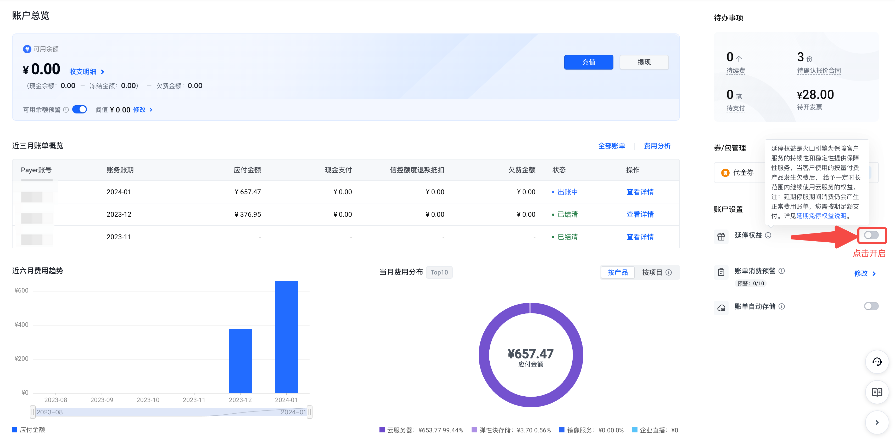
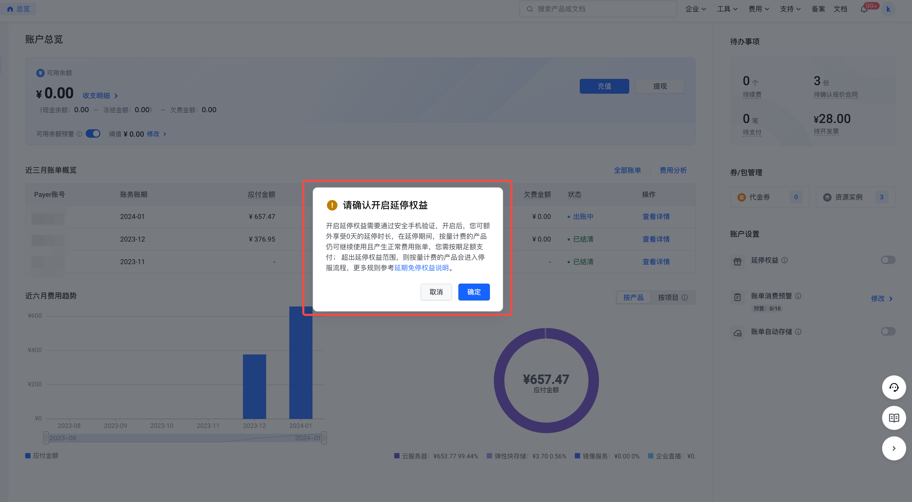
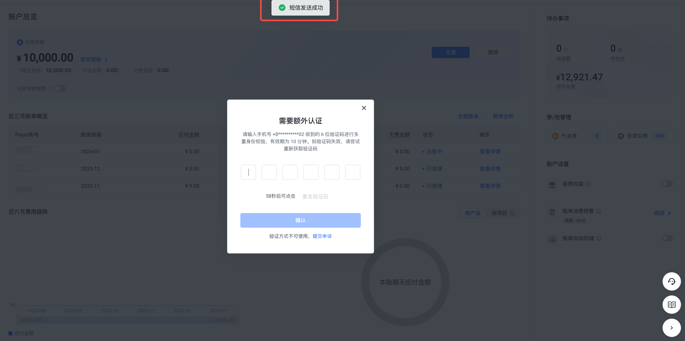
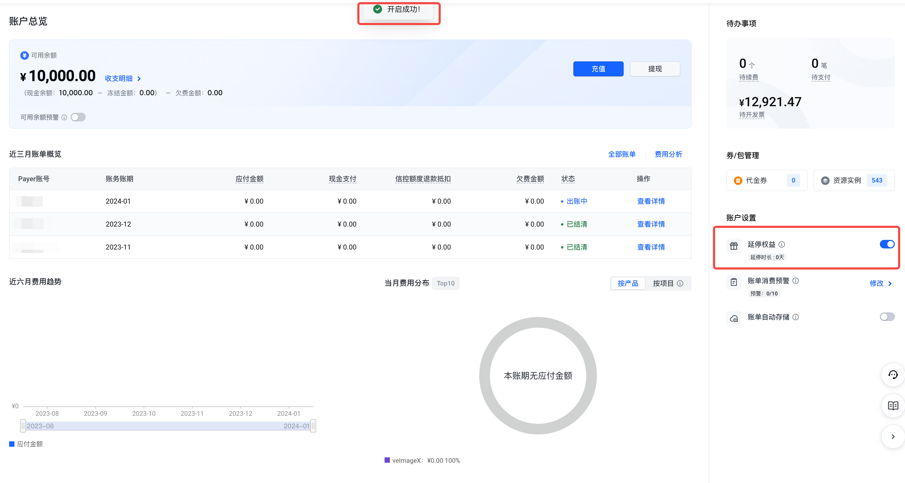
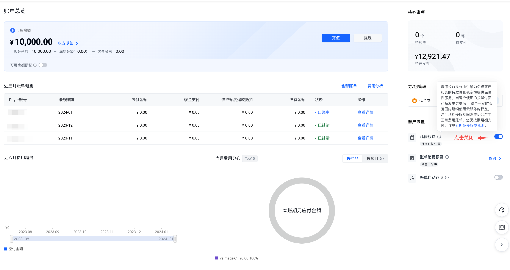
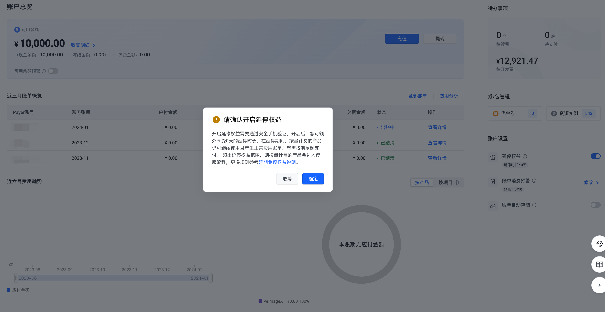
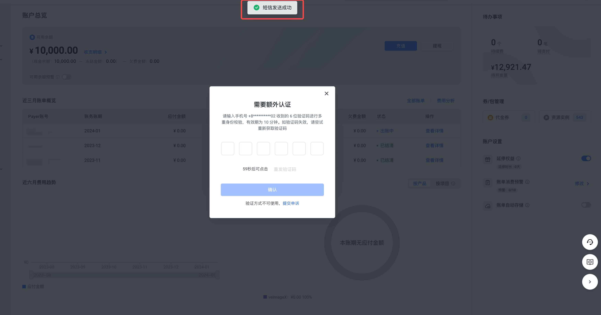
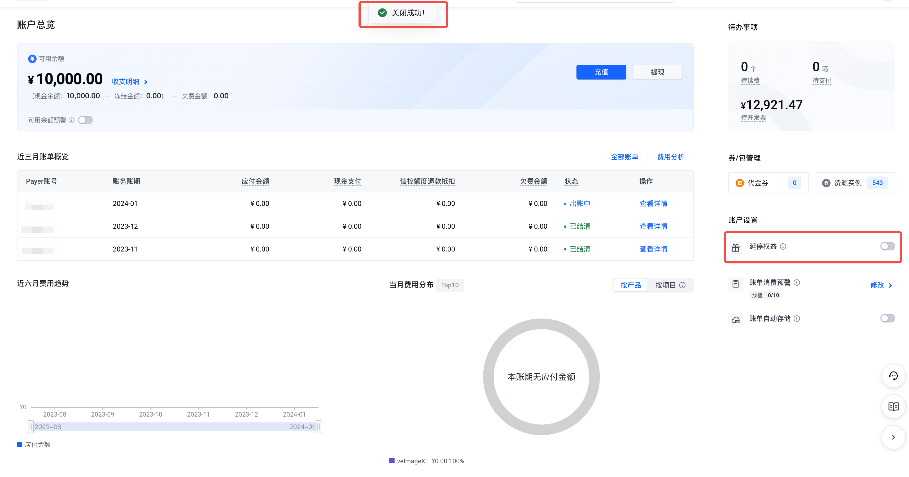

# 延期免停权益说明

## 什么是延期免停权益

延停权益（又称延期免停权益）是火山引擎为客户提供的保障服务持续性和稳定性的功能。客户需要登陆火山引擎官网控制台申请开启该权益。延停权益开启后，系统将根据历史消费、人工定级等因素或信控情况，在客户处于欠费状态下赋予一定时长范围内继续使用云服务的权益。延停期间服务仍可正常使用且正常计费，您需按期足额支付。延停场景如下：

**延停权益开启：**
- 当账户可用余额<0时，在延停权益的时长范围内，按量付费的实例（或服务）仍可正常使用。
- 当账户可用余额<0时，超出延停权益的时长范围，按量付费的实例（或服务）将会进入停服处理流程。

**延停权益未开启：**
- 当账户可用余额<0时，按量付费的实例（或服务）将会进入停服处理流程。

## 延停权益开启后，如何计算延停时长

- 系统将结合历史消费、人工定级等因素自动赋予0～10个自然日的延停时长。
- 若已签署信控协议且信控额度大于0，则享有3个自然日的延停时长。

> **说明**：每个账号可享受的延停权益不叠加，系统将优先取较长的时间作为您最终可享受的延停时长（最长为10个自然日）。

## 风险提示

- 延停期间产生的账单为正常的服务费用账单，您需按期足额支付。
- 超出延停权益的时长范围后，按量付费的实例（或服务）将会进入停服处理流程，请及时进行充值以保障服务连续性。

## 特殊说明

- 财务托管期间，托管子账号的延停权益将与主账号一致。
- 代售期间，终端客户不享有延停权益，即不允许开启延停权益。

## 操作步骤

### 开启延停权益

1. 进入"费用中心-账户总览"页面。

2. 将"启用延停权益"按钮置为开启状态。

3. 确认开启延停权益信息。

4. 进行安全手机验证，验证通过后即可开启成功。

### 关闭延停权益

1. 进入"费用中心-账户总览"页面。

2. 将"启用延停权益"按钮置为关闭状态。

3. 确认关闭启延停权益信息。

4. 进行安全手机验证，验证通过后即可关闭成功。

---
最近更新时间：2025.09.23 15:56:44
