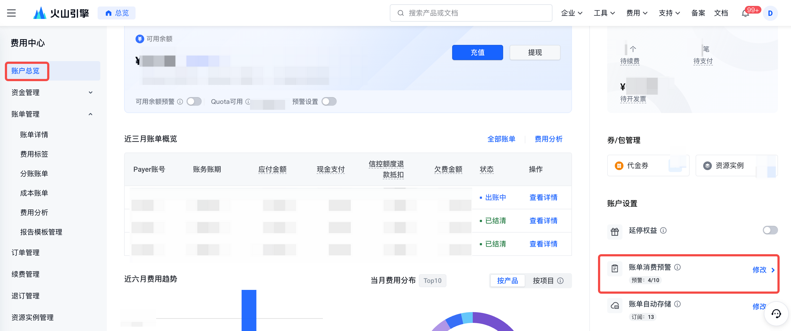
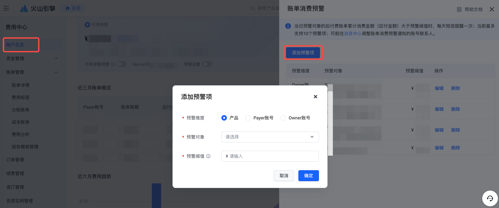
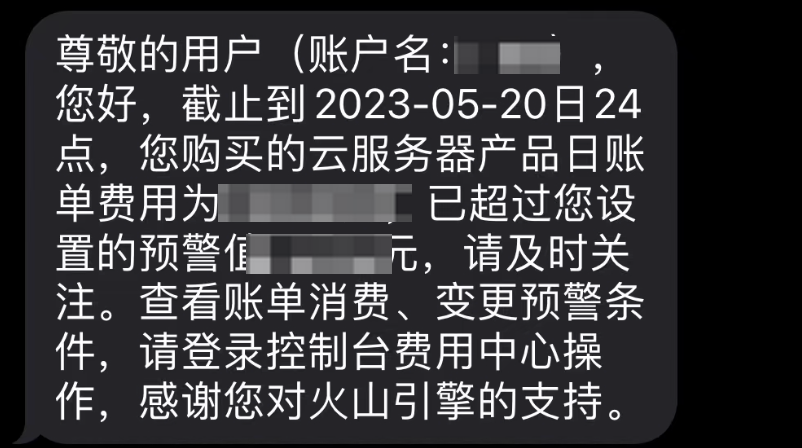
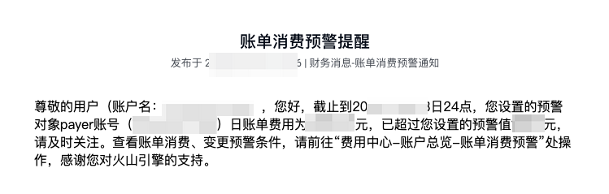

# 设置账单消费预警

## 功能简介

您可按需设置账单消费预警。当产品或账号的后付费日账单累计消费金额大于预警阈值时，对用户进行短信/邮件/站内信等提醒。

### 预警规则

- 统计范围为交易时间在当日0-24点的账单应付金额，当产品或账号的后付费日账单累计消费金额大于预警阈值时，发送预警通知。
- 最多可设置30个预警项，当达到预警条件的预警项较多时，短信因渠道频控限制可能无法接收短信，请按需设置预警项。
- 一个预警项一天提醒一次。通知时间为次日上午，接收人为账号联系人，默认通知渠道为短信。您可前往消息中心调整账单消费预警通知的联系人和通知渠道。

## 操作步骤

### 进入账户总览

点击"账单消费预警"按钮，展开设置预警项抽屉页；

### 添加预警项

点击"添加预警项"，您可在弹窗中按需设置预警维度、预警对象、预警阈值；当前支持对产品、Payer账号、Owner账号3种维度的预警；

### 查看预警项

在抽屉页列表，您可查看添加的预警项，也可通过编辑来调整预警项内容、或按需删除预警项。

### 接收预警通知

渠道通知内容如下，告警后您可选择前往控制台-费用中心查看完整账单数据；

**短信：**

**站内信/邮箱消息通知：**

---
最近更新时间：2025.07.11 15:31:14
