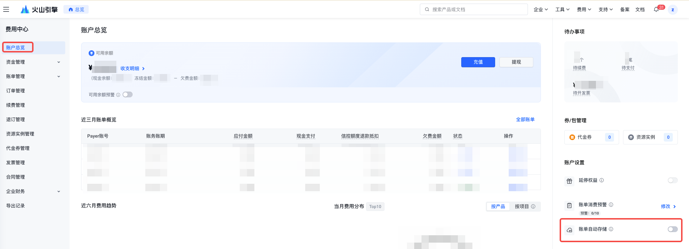
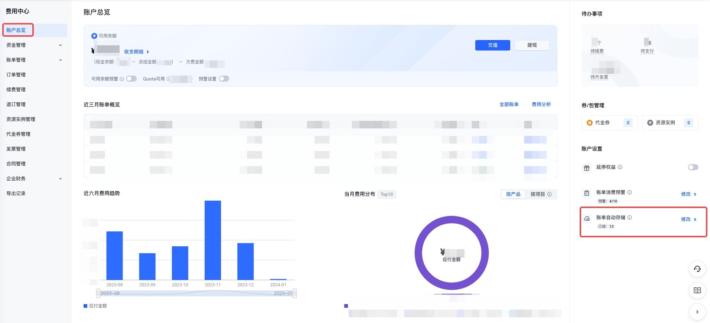
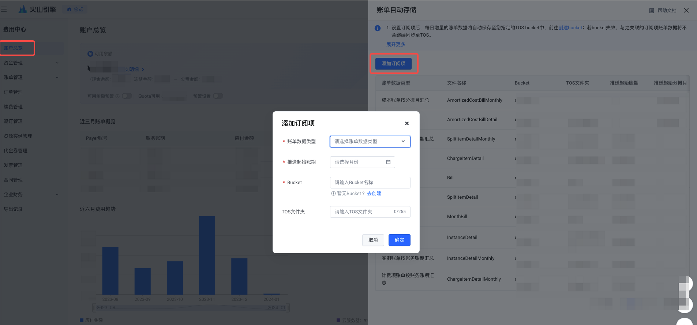
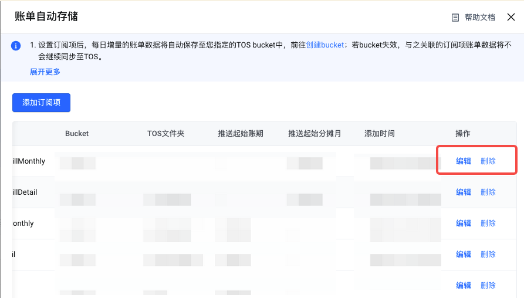

# 账单存储TOS

## 功能简介

用户设置账单存储TOS后，火山引擎会将账单文件同步存储至您TOS指定的bucket或TOS文件夹中；

目前支持订阅的账单数据类型有：月账单PDF、计费项明细账单、计费项账单按天汇总、计费项账单按账务账期汇总、实例明细账单、实例账单按天汇总、实例账单按账务账期汇总、账单、分账账单明细、分账账单按天汇总、分账账单按账务账期汇总、成本账单明细、成本账单按分摊月汇总、费用分析报告模板；

> **注**：上述明细文件在生效中的月份将按天持续投递增量数据（一日一份明细文件），并且会在次月第2自然日开始投递上月的月汇总明细（一月一份明细汇总文件），您可在第3自然日获取计费项明细的月汇总文件，分账明细和成本明细延迟T+2日；相比明细数据，文件中项目标签信息延迟T+1更新，非明细文件延迟T+1更新；

日订阅账单数据仅作参考，不作为对账依据，如需核对，请以最终月账单数据为准；

> **说明**：月中可能会发生以下场景：延迟出账、退款、调账等，费用账单建议在次月第4个自然日10点后拉取账单文件，分账账单及成本账单请于次月第5自然日10点后拉取账单文件。（若存在计费模式=合同计费的账单时，请于次月第5工作日拉取费用账单、第6工作日拉取分账账单及成本账单文件。）

文件命名：UID_文件名_YYYYMMDD（月数据为YYYYMM），各账单类型文件名可见文末处说明；

> **注意**：
> 1. 订阅的账单文件一般最晚在数据生成后的次日24点前存储至TOS；
> 2. 除月账单PDF之外，从2023年7月后新增/编辑的订阅项的账单数据类型均为ZIP格式；
> 3. IAM子用户订阅存储TOS的权限策略说明和授权指引详见"费用中心-权限管理";

## 操作步骤

### 账号授权

该授权内容为允许账单服务投递文件至您的TOS桶；

1. 进入"费用中心-账户总览"，点击右上角账单自动存储栏的"去开通"；若未授权，需在提示框内点击"授权服务"跳转至跨服务访问请求页，授权后可原路返回账户总览页；

### 进入设置页面

2. 授权完成后，点击"修改"，即可进入设置账单数据存储页；

### 添加订阅项

3. 在设置账单数据存储页，点击列表左上方"添加订阅项"，选择需要存储的账单数据类型、推送起始账期等，输入Bucket名称进行订阅；

> **注**：推送起始账期支持选择自2022-01账期以来的账单进行补充推送。对于每日新增账单数据，平台每天会将订阅项相关账单生成文件同步存储至您TOS的bucket中。

### 查看/编辑/取消订阅项

4. 查看订阅项：在下方列表，您可查看添加的订阅项；

5. 编辑/取消订阅项：点击列表右侧"编辑"/"取消"，可编辑/取消对应订阅项的账单数据存储TOS；

### 管理投递文件

在TOS控制台，您可查看、管理存储的订阅文件，操作指引见: TOS文件管理;

各账单数据类型投递文件的文件名称如下：

| 账单数据类型 | 文件名称 | 说明 |
|-------------|---------|------|
| 月账单PDF | MonthBill | 与账单总览中导出的月账单pdf一致； |
| 账单 | Bill | 与账单页导出的账单csv完整表格内容一致； |
| 计费项明细账单 | ChargeItemDetail | 与账单明细中「统计项=计费项&统计周期=明细」时的完整表格内容一致； |
| 计费项账单按天汇总 | ChargeItemDetailDaily | 与账单明细中「统计项=计费项&统计周期=按天」时的完整表格内容一致； |
| 计费项账单按账务账期汇总 | ChargeItemDetailMonthly | 与账单明细中「统计项=计费项&统计周期=账期」时的完整表格内容一致； |
| 实例明细账单 | InstanceDetail | 与账单明细中「统计项=实例&统计周期=明细」时的完整表格内容一致； |
| 实例账单按天汇总 | InstanceDetailDaily | 与账单明细中「统计项=实例&统计周期=按天」时的完整表格内容一致； |
| 实例账单按账务账期汇总 | InstanceDetailMonthly | 与账单明细中「统计项=实例&统计周期=账期」时的完整表格内容一致； |
| 分账账单明细 | SplitItemDetail | 与分账账单中「统计周期=明细」时的完整表格内容一致； |
| 分账账单按天汇总 | SplitItemDetailDaily | 与分账账单中「统计周期=按天」时的完整表格内容一致； |
| 分账账单按账务账期汇总 | SplitItemDetailMonthly | 与分账账单中「统计周期=账期」时的完整表格内容一致； |
| 成本账单明细 | AmortizedCostBillDetail | 与成本账单中成本明细页面的完整表格内容一致； |
| 成本账单按分摊月汇总 | AmortizedCostBillMonthly | 与成本账单中成本总览页面的完整表格内容一致； |
| 费用分析报告模板 | CostAnalyse | 与费用分析报告模板页面的统计报表内容一致； |

---
最近更新时间：2025.10.31 18:04:13
