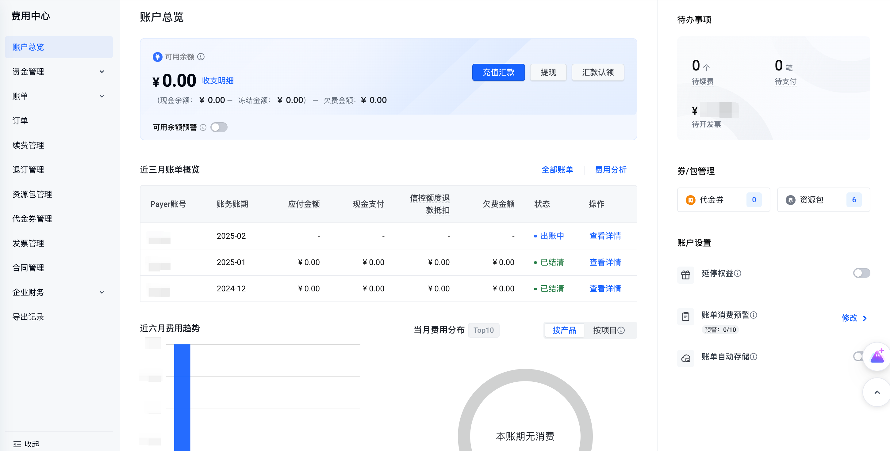

# 账户说明

## 概述

账户总览包含以下模块

- 账户概况：支持查看可用额度并设置额度预警，提供收支明细、充值、提现的快捷操作入口。
- 消费统计：支持快捷查看"月账单概览"、"费用趋势"、"费用分布"信息。
- 待办事项：支持快捷查看待续费手动续费实例个数、待支付订单数量、待开票金额、待确认合同数量。
- 券/包管理：支持快捷查看待生效及生效中的代金券数量及生效中的资源包数量。
- 账户设置：支持设置"延停权益"、"账单消费预警"、"账单自动存储"。

## 板块说明

| 卡片 | 操作 | 说明 | 相关文档链接/操作说明 |
|------|------|------|----------------------|
| 可用余额 | 查看可用余额 | 可用余额： 体现您在火山引擎的资金状况，同时通过该余额控制您资源的停复机； 可用余额=（现金余额-冻结金额）+信控额度-欠费金额； 现金余额：当前用户现金账本余额； 冻结金额： 现金余额中冻结的部分； 信控额度： 授信、增信、降信、回收后的生效的授信金额； 欠费金额：账单上的未付金额； ⚠️注意：可用余额为负数时，资源可能会被关停，为了保证您的业务正常运行，请及时充值。 | - |
| | 充值 | 提供充值的便捷操作入口，点击"充值"可跳转至充值页面操作。 | [充值操作指引](../资金管理/充值操作指引.md) |
| | 提现 | 提供提现的便捷操作入口，点击"提现"可跳转至充值页面操作。 | [提现操作指引](../资金管理/提现操作指引.md) |
| | 收支明细 | 提供查看收支明细的便捷操作入口，点击"收支明细"可跳转至充值页面操作。 | [收支明细](../资金管理/收支明细.md) |
| | 可用余额预警 | 您可为当前账号设置余额提醒，若设置的阈值提醒小于当前可用余额，消息不会立即触发，只有可用余额有变动时且仍小于阈值提醒会触发消息；连续提醒5次，首次实时发送，后4次为第二日10点发送。 | - |
| 消费统计 | 月账单概览 | 客户可查看仅三个月的月账单概览数据。 | [新版账单管理](../账单/新版账单管理.md) |
| | 月费用趋势 | 客户可查看仅六个月的月消费趋势。 | |
| | 当月费用分布 | 客户可查看当月费用分布数据。 | |
| 待办事项 | 待续费实例 | 展示7天内到期的运行中实例和即将关停的手动续费的实例总数，点击数字可跳转至"续费管理-手动续费"页面查看详情。 | [续费规则概览](../续费管理/续费规则概览.md) |
| | 待支付订单 | 展示状态为"待支付"的订单总数，点击数字可跳转至"订单管理"页面查看详情。 | [订单管理](../订单/订单管理.md) |
| | 待开票金额 | 展示待开票总金额，开票仅针对已消费金额，充值未消费部分无法开具发票。点击数字可跳转至"申请发票"页面操作。 | [发票管理](../发票/开票操作指引.md) |
| | 待确认合同 | 展示状态为"待确认"的产品报价合同数量，点击数字可跳转至"合同管理-产品报价合同"页面操作。 | [产品报价合同](../合同管理/产品报价合同.md) |
| 券/包管理 | 查看代金券 | 客户可以查看待生效及生效中的代金券数量，点击数字可跳转至"代金券管理"页面查看详情。 | [代金券管理](../代金券管理/代金券管理.md) |
| | 查看资源包 | 客户可以查看生效中的资源包数量，点击数字可跳转至"资源包管理"页面查看详情。 | [资源包概述](../资源包管理/资源包概述.md) |
| 账户设置 | 延停权益 | 延停权益（又称延期免停权益）是火山引擎为客户提供的保障服务持续性和稳定性的功能。客户需要登陆火山引擎官网控制台申请开启该权益。 | [延期免停权益说明](延期免停权益说明.md) |
| | 账单消费预警 | 您可按需设置账单消费预警。当产品或账号的后付费日账单累计消费金额大于预警阈值时，对用户进行短信等提醒。 | [设置账单消费预警](设置账单消费预警.md) |
| | 账单数据存储 | 用户设置账单存储TOS后，火山引擎会将账单文件同步存储至您TOS指定的bucket中。 | [账单存储TOS](账单存储TOS.md) |

---
最近更新时间：2025.02.08 15:01:56
