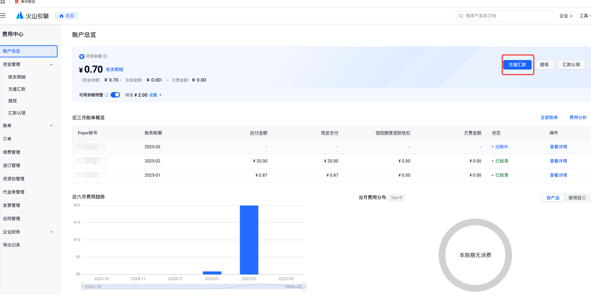
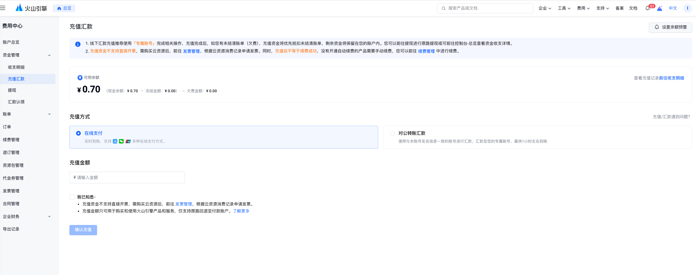
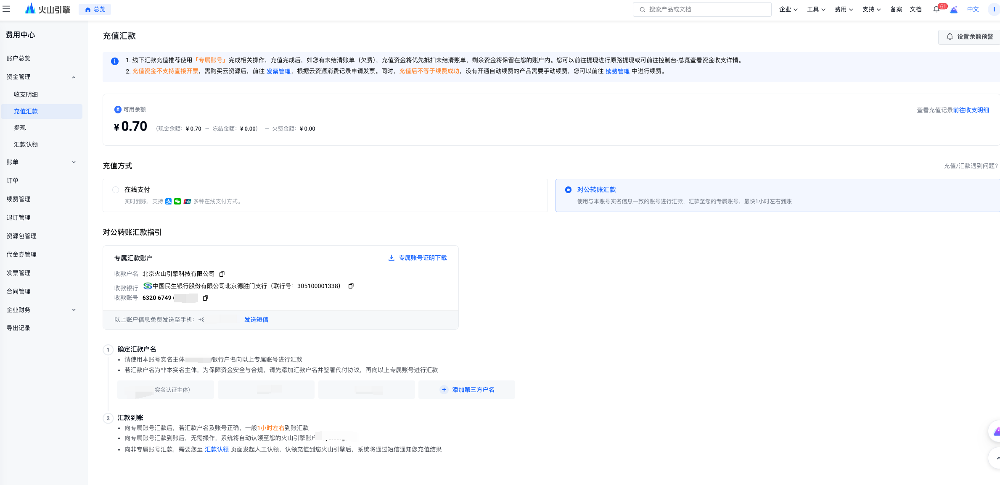

# 充值操作指引

## 使用场景

火山引擎为用户提供账户充值业务，充值后的金额可用于平台官网上各类产品的下单支付，或者自动抵扣后付费账单。

> **注意**
> - 充值的金额需在消费后才可开具发票。
> - 充值金额只可用于购买火山引擎产品和服务；若无需求，资金提现且仅支持原路回退。

## 充值入口

前往账户总览，点击充值汇款按钮，您可跳转至充值页面，在此页面输入充值金额，及选择充值方式来完成充值。

## 操作说明

目前火山引擎支持在线充值和对公转账汇款两类充值方式，您可以选择合适的方式进行充值；

### 1. 在线充值

指用户登录火山引擎官网，前往控制台费用中心充值页通过支付宝、微信、网银（个人/企业）在线支付充值余额；

进入账户总览菜单，点击充值汇款，跳转到在线支付页面，您可以指定充值金额；

输入充值金额后，点击下一步，跳转到如下支付页面，您可选择自己的充值方式，目前支持支付宝、微信、个人网银、企业网银4种在线支付的方式；

充值完成后可返回账户总览页面进行流水核对；

### 2. 对公转账汇款

指用户采用对公汇款的方式对火山引擎账户进行充值；

您可以申请获取火山引擎专属汇款账户用于给火山引擎账号转账汇款使用，汇款到账后资金自动到账无需认领；

若您直接向火山引擎基本收款账户进行汇款后，您需要前往"汇款认领"页面，发起流水认领，认领后资金方可到账。

> **说明**
> 
> 专属汇款账户默认是未开通状态，您选择"对公转账汇款"方式后，在界面下方点击"获取专属汇款账户"，开通完成后可在页面查询到分配至您的专属汇款账户。请使用与本账号实名信息一致的银行付款账号，若银行付款账号名与实名信息不一致，需提前签署《代付协议》后在进行汇款。

专属汇款账户为火山引擎在中国民生银行开设的银行账号后面，为每位用户分别配置一串数字ID用以区分用户，您可将银行账号+数字ID的作为汇款的收款账号，填写在银行的汇款收款账号之后，火山引擎在收到银行到账信息后，会自动识别专属汇款账户，并将对应金额充值到您的火山引擎的账号。

> **注意**
> 
> 注意专属汇款账户千万确保输入正确，您的错误输入会直接导致金额会充值到他人账户。

若您当前还未有专属汇款账户，则需要先申请，申请之后即可查看您的专属汇款账户；

---
最近更新时间：2025.03.04 14:59:53
