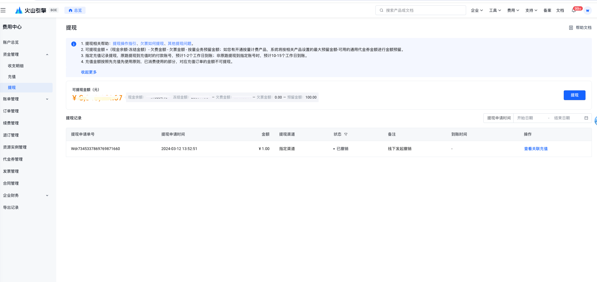
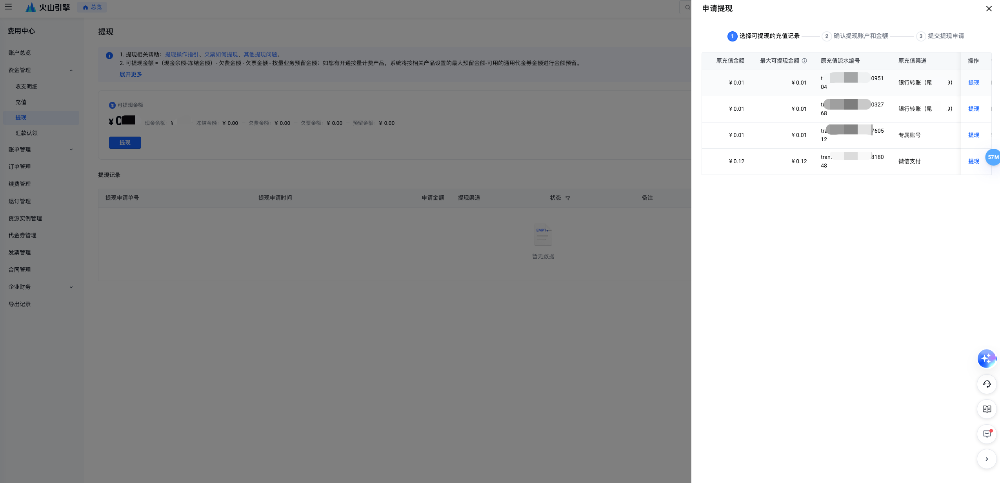
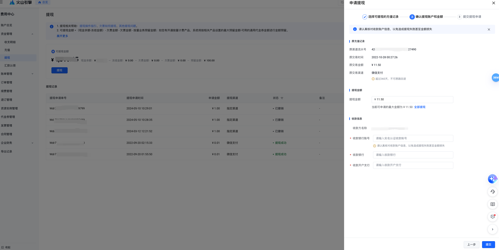
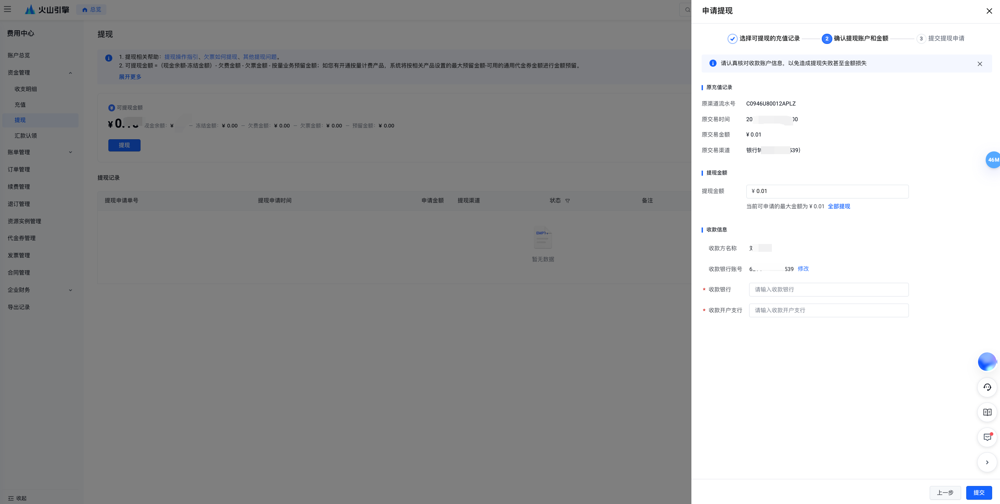

# 提现操作指引

## 使用场景

用户充值到火山引擎账户的资金可以用于平台官网上各类产品的下单支付，或者自动抵扣后付费账单。如果用户后续不再订购火山引擎的产品，可以通过提现的方式将余额退回至付款账户。

## 操作入口

进入费用中心-账户总览，可以看到您的余额和提现入口，点击提现按钮，进入到提现页面进行提现操作。

## 可提现金额计算

可提现金额 = （现金余额-冻结金额） - 欠费金额-欠票金额 - 按量业务预留金额；

- **现金余额**：当前用户现金账本余额；
- **冻结金额**：现金余额中冻结的部分，冻结只改变现金的可操作状态，不改变现金余额；
- **欠费金额**：账单上的未付金额；
- **欠票金额**：当可开发票金额为负数时，即为欠发票金额，退回发票才能释放此金额；
- **按量业务预留金额**：未开通后付费产品，金额为0；若开通后付费产品，会基于商品配置的"预留金额"（若开通多个商品，取最大值）再减掉可用的代金券进行取值。

## 提现方式

### 原路提现

通过支付宝、微信、网银（个人/企业）等在线支付充值的余额，可以通过原路退回提现。充值后，最长可支持360天内的原路退提现。

### 线下提现

- 通过线下汇款充值的余额，提现至充值对应的银行账号中，允许修改账号不允许修改收款人名称。
- 通过支付宝、微信、网银（个人/企业）等在线方式充值的余额，当超过360天，充值无法原路回退，提现退至实名认证同名的银行卡中。

### 提现到账时效

- 若退至微信/支付宝/网银等，预计1-2个工作日到账；
- 若退至您的银行卡中，需火山引擎内部财务审批、线下打款，预计10-15个工作日到账。

## 提现流程

### 0. 提现页

进入提现页，点击提现按钮；

### 1. 选择可提现的充值记录

### 2. 确认提现账户和金额

若选择微信/支付宝/网银等在线支付的充值流水且未超过360天，资金将基于您的支付方式进行原路回退。

若选择微信/支付宝/网银等在线支付的充值流水且超过360天，资金将退回至实名认证同名的银行账号中。

若选择线下汇款的充值流水，资金将默认回退到你原充值的银行账号中。

> **说明**
> 
> 若退款到银行账户，需补充您的收款行信息(银行账号、银行及分支行)，请务必保障银行账号的准确性，避免因卡号错误导致提现失败或者资金损失。

### 3. 提交提现申请，查看提现记录

对已经申请提现的历史，您可以在提现页面的提现记录列表中查看记录和确认状态。

- 您可以查询到全部的提现记录，含您自己发起，以及运营后台发起的提现记录。
- 您可查询到提现的进度，审批通过后，进入到待打款的流程；
- 我们在尝试银行转账时，如您提供的账号有误，会出现打款失败的情况。您可提供正确账号重新发起提现申请。

> **说明**
> 
> 提现申请成功后，将会冻结您提现部分的资金，冻结部分资金将不可用与订单及账单的消费。

---
最近更新时间：2024.05.11 17:09:46
