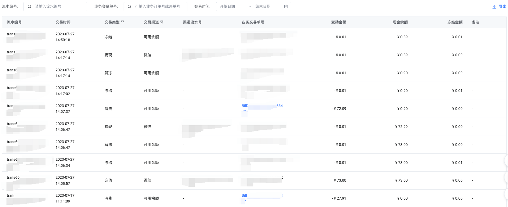

# 收支明细

您可以在账户总览页面查看现金账户的收支明细信息，并支持导出。

## 列表元素

- **流水编号**：本次交易记录的流水编号
- **交易时间**：本次交易的时间点
- **交易类型**：本次交易的类型，类型分为充值、消费、退款、调整、提现、冻结、解冻等。
- **交易渠道**：本次交易的交易渠道，分为微信、支付宝、网银、专属汇款账号、线下汇款、可用余额。
- **渠道流水号**：本次交易的渠道流水号；
- **业务交易单号**：本次交易的业务交易单号；当交易为下单消费或账单还款时，可通过点击订单号或账单号跳转至查看对应的账单详情；
- **变动金额**：本次交易的金额；
- **现金余额**：交易后的现金余额；
- **冻结金额**：现金余额中冻结的部分；
- **备注**：本次交易的备注；

## 收支明细与账单的区别与关系

- **收支明细**：收支明细是实时的记录了用户现金账户的所有操作，包括：充值、消费、退款、提现、冻结、解冻等；
- **账单**：账单用来反映用户在火山引擎的消费情况以及对应的资源详情；

---
最近更新时间：2023.09.25 17:29:13
