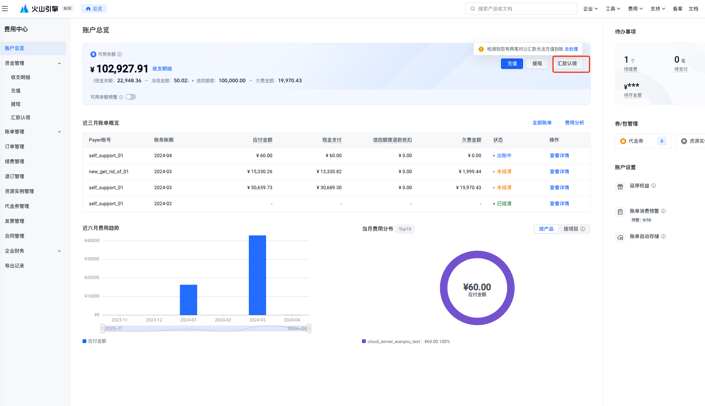
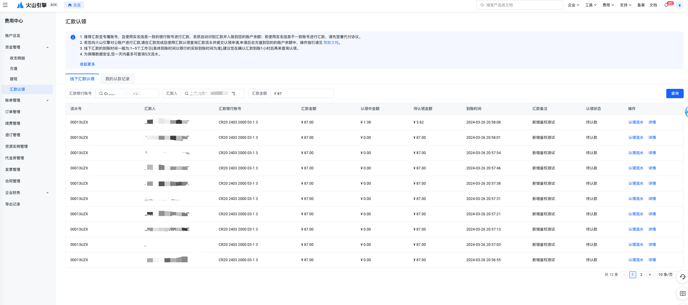
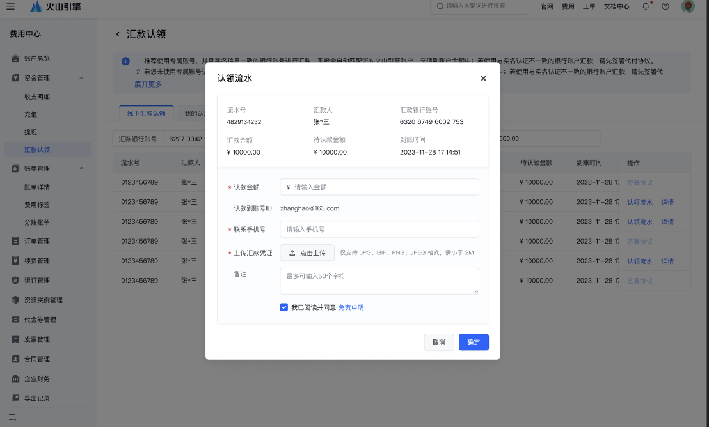

# 自助认领操作指引

## 使用场景

当您通过银行直接向火山引擎的基本收款账号进行汇款后，您需要前往"汇款认领"页面，发起对应流水的认领申请，申请通过后，对应认领的金额会充值到您火山引擎余额。

> **注意**
> 
> 1. 火山引擎为每个用户都分配了专属账号，您可前往申请开通；开通后通过实名认证主体一致的银行账户向专属账号汇款后，系统会直接将汇款自动匹配到您的火山引擎账户余额中，无需您来认领。
> 
> 2. 为防止诈骗或者洗钱的风险，对于使用与实名认证主体不一致的银行账户进行汇款的，请先签署代付协议同时火山引擎会进一步核查及审慎判断，有权拒绝可能存在异常情形的相关汇款。

## 认领前的准备工作

需要准备好以下资料：
- 需要认领的汇款流水，及银行的汇款凭证。
- 待认领的火山引擎账号、认领的金额、联系电话。

## 操作入口

1. 前往"账户总览"的首页，点击账户可用额度板块内的汇款认领，进入汇款认领页面操作：

2. 费用中心左侧导航菜单汇款认领

## 操作说明

### 查询流水

发起认领前，需要您先查询到对应的流水，然后针对查询到的流水发起认领。

为了保证数据的安全，系统需要您输入汇款人、汇款账号、汇款金额，三个查询条件完全匹配后给出查询结果，且每天的查询限定为5次查询，查询5次后，您当天将无法再发起流水的查询。

一组汇款账号、汇款人、汇款金额组合成为一次查询条件，对同一查询条件可重复查询，每个账号每天5次查询机会。

### 查询结果

查询到的结果后，您可以看到汇款的金额、待认领的金额、认领中的金额。

认领中的金额是指：已经发起认领但未充值到账的金额。

### 发起认领

在查询到流水后，您可对待认领的流水，点击"认领"按钮来发起认领。

您需要输入认领的金额、联系电话、汇款凭证等信息。

认领账号默认为当前的账号。

勾选免责声明后方可完成认领。

---
最近更新时间：2024.05.10 14:59:42
