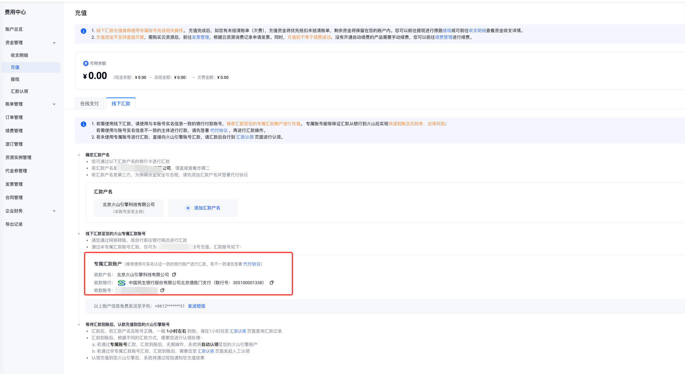
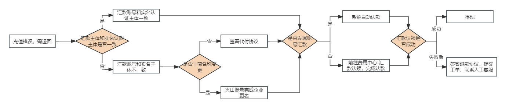
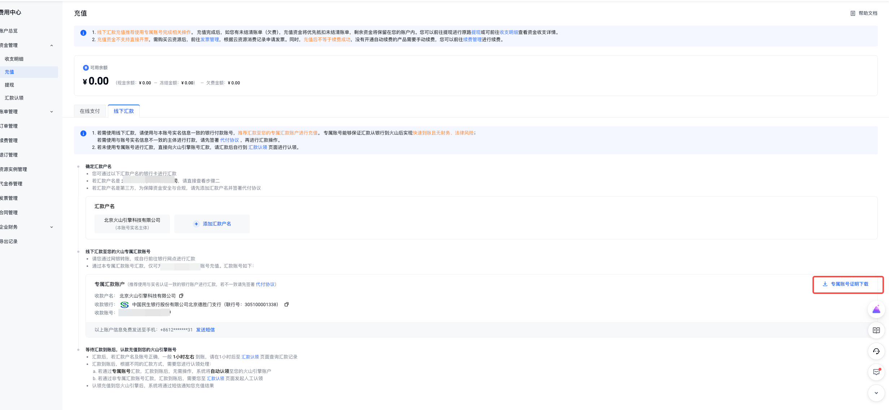
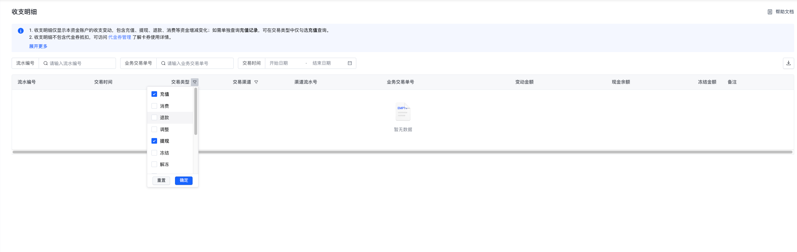
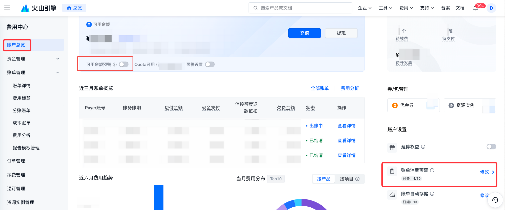
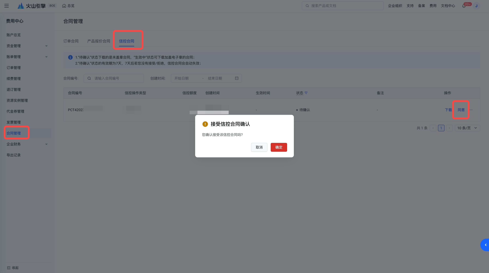

# 资金常见问题

本文档汇总了火山引擎资金充值、认款、提现等使用过程中的常见问题及解决办法，如果您在使用过程中遇到问题，可以参考以下处理方案。

## 一、充值

### 火山引擎支持哪些充值方式？

目前火山引擎支持在线充值和对公汇款转账两类充值方式。

- **在线充值**：支持支付宝、微信、个人网银、企业网银4种在线支付的方式；
- **对公汇款转账**：推荐您使用专属汇款账号进行对公汇款的方式，对火山引擎账户进行充值；
  - 如需申请专属账号，可前往【费用中心】-【充值】-【线下汇款】页面进行申请。您可以参考[充值操作指引](充值操作指引.md)
  - 如您向火山引擎的收款账号汇款，汇款完成之后，请您前往控制台使用自助认款功能，输入相关信息后，手动进行认款操作。如您输入正确汇款信息未查询到认款的流水，可能是由于银行处理原因，该笔流水还未到火山，请您稍等1-2小时刷新重新尝试。

### 对公汇款账号如何获取？

可前往费用中心，点击【充值】-【线下汇款】页面获取专属收款账号信息。

### 充值时更换银行账号，或者由他人代付，火山账号还能正常汇款认领？

- 若您的银行户名是和火山账号实名认证一致的情况，可以正常认领；
- 若汇款主体与认款火山账号主体不一致，需前往【合同管理-代付合同】签署代付协议后再自助认款。

> **请注意**：如对公汇款由他人代付，无法提现至您实名认证的银行卡内，仅支持退款到代付人的银行账户中，为保障您的交易资金安全，建议您所使用的支付账号所属企业/个人，与当前账号实名认证信息一致。

### 线上支付充值界面提示限额/风险怎么办？

线上支付充值界面提示限额/风险为交易第三方渠道的限制，火山引擎侧不对用户汇款额度做限制，您可按照第三方页面提示操作降低额度充值，或者更换充值和汇款方式，使用对公汇款。

### 网银充值时显示充值失败，如何处理？

您可以先确定您充值的火山引擎对款账号正确无误，若付款账号无误，且网银提示充值失败，需要您联系相应银行咨询

### 充值金额如何开票报销？

充值金额不可直接开票。您可以在充值完成，已充值金额下单购买资源消费后，依据消费订单、账单申请开具发票。

### 为什么无法充值？

以下情况下可能您无法充值：
1. 账号未完成实名认证，需您完成实名认证后，才可充值。
2. 您公司的主账号管理员，将您账号未授予费用中心权限，您可以根据看到相应提示，联系主账号咨询开通费用中心权限后，再进行充值操作。
3. 抖音云账号未绑定安全邮箱信息导致无法充值。您可在抖店云控制台左侧导航栏找到 支持-权限管理页，点击身份管理，在用户列表选择当前登录的子账号，并绑定安全手机或者安全邮箱即可。

### 充值错误怎么退款？

如您因为专属账号填写错误，汇款主体错误等导致打款主体和打款账号不符合预期，需要退回，您可以参考以下流程：

1. 如果充值账号主体与汇款主体为同一个主体，可以认款后提现重新充值。
   > 注：充值认款账号若存在待支付账单，认款后充值金额将默认被账单金额核销，导致提现金额减少
2. 如果充值账号主体与汇款主体为不同主体，认款账号可以前往控制台【合同管理-代付合同】签署代付协议后进行认款
3. 如汇款的专属账号有误，无法认款，需要直接退款，请按照火山引擎-退款确认函，填写相关信息并盖章后，提交工单联系火山引擎售后同学，我们预计10-15个工作日将款项退回到您充值的账户内。
4. 若因企业名称变更导致汇款主体（新名称）与账号主体（曾用名）不一致，请前往账号管理-火山引擎参照文档进行企业名称变更后再进行认款操作。

## 二、对公汇款

### 汇款认领没有找到银行流水信息？

查询不到流水存在以下几种可能：
1. 汇款银行账号，汇款人，汇款金额三个为必填项，请您输入正确的信息，如输入信息有误，可能无法查询到汇款流水
2. 请在客户银行已完成汇款操作后1h左右前往汇款认领功能查询流水，确保此时汇款已到达火山引擎
3. 客户汇款银行账号为04-328300040000000该类数据，需要去掉"-"查询
4. 客户汇款名称存在括号（），请保证同银行注册名称使用的括号中英文输入一致。

### 线下对公汇款没有到账什么原因？

1. 检查汇款信息是否正确：根据银行打款要求，汇款时填写的收款人名称、收款账号、开户支行等信息全部正确才能成功汇款。
2. 如果使用专属汇款账号进行汇款没有到账，原因如下：
   - 受银行处理时间影响，线下汇款方式到账会有延误，一般1-24小时到账。
   - 请检查汇款使用的专属账号对应火山账号主体与本次汇款使用的银行账号主体一致，若汇款主体不一致则需要前往费用中心-【合同管理-代付合同】申请代付合同，完成签署后系统后续会自动认领款项
3. 如果使用火山收款账号进行汇款没有到账，原因如下：
   - 受银行处理时间影响，需在确认银行打款完成后再前往费用中心-【汇款认领】输入汇款流水进行手动认领。
   - 若汇款主体与认款火山账号主体不一致，需前往【合同管理-代付合同】签署代付协议后再自助认款。

### 线下汇款充值多久能到账？

- 若汇款至非专属账号，可在银行汇款后1h前往费用中心-【汇款认领】输入汇款流水进行手动认领。
- 若汇款主体与账号实名一致，且使用专属汇款账号进行充值，将会在1-24小时内充值到账户余额中，若长时间未到账，可以联系火山引擎侧，提供银行回单进行确认。

### 如何进行对公汇款？

目前火山引擎支持在线充值和线下汇款两类充值方式。您可以前往账户总览，点击"充值"按钮，跳转至充值页面进行操作。线下汇款（对公汇款）：指用户采用对公汇款的方式将资金充值到火山引擎账户内。

> **注意**：如您进行对公汇款，建议您使用银行汇款方式向火山引擎账号打款，不建议您使用第三方（支付宝/微信钱包）向火山引擎账号对公打款，火山引擎将无法识别汇款主体，届时将增加您认款的难度。

### 专属汇款账号与基本汇款账号区别是什么？

- 使用专属汇款账号充值后，待汇款银行完成转账操作，系统将会自动认款至专属汇款账号关联的火山账号中。
- 使用火山引擎收款账户充值后，待汇款银行完成转账操作，需要您前往汇款认领控制台完成自助认款操作。

### 如何获取专属账号证明文件？

您可以在费用中心--充值-线下充值下，申请专属汇款账号后，单击专属汇款账号电子证明下载，获取您的专属账号说明文件。

### 什么时候需要签署代付协议？

若汇款主体与认款火山账号主体不一致，需前往【合同管理-代付合同】签署代付协议后再自助认款。如您签署完成代付协议后，往专属账号进行汇款，也无需您手动认领，系统将自动认款。

### 线下汇款没有认领成功系统自动退回吗？如何退回款项呢？

如果您汇款无法认领或其他原因认领失败，汇款流水系统认领失败后不会自动发起退回，如需退回款项请参考以下方案：

1. 如果充值账号主体与汇款主体为同一个主体，可以认款后提现退回款项。
2. 如果充值账号主体与汇款主体为不同主体，认款账号可以前往控制台【合同管理-代付合同】签署代付协议后进行认款
3. 如系统原因无法认款需要直接退款，请按照《退款确认函》填写相关信息并盖章后，提交工单联系火山售后同学，我们预计10-15个工作日将款项退回到您充值的账户内。

## 三、提现

### 提现时页面提示没有权限，怎么办？

1. 可能因为当前账号未设置安全手机号和安全邮箱，您可以根据页面提示，点击红框中的链接，在用户详情页绑定安全手机或者安全邮箱。
2. 主账号未给授权费用中心权限，请您联系主账号管理员给子账号授予相关权限后操作。

### 为什么可提现金额小于现金余额？

根据可提现金额的计算公式，可提现金额=现金余额—冻结金额—欠费金额—欠票金额—预留金额，所以可能您的账户余额充足，但并不一定可以将其全部提现。

- 如果有按量付费资源，提现时会扣留一定的预留金，以防您全额提现之后，按量计费的资源出现欠费和停机问题；若您不再需要继续使用相关后付费产品，可选择退订。退订完成，按量计费资源销毁后，将不再预留该金额。届时预留金额将会被释放，您可以正常提现预留的金额。
- 如果有欠票金额，欠票部分无法被提现。您可以选择退票后即可提现。

### 提现到账账户是如何确定的？

- 线上充值的资金，退至您原路径的账号（如微信支付退至微信）；但微信支付宝若超过360天、网银支付180天，仅支持退至与本账号实名认款一致的收款人银行账户中，无法原路回退到您的原支付渠道。
- 线下汇款的资金：按照您在线上汇款的账号原路回退，允许修改账号信息（收款人信息不允许修改），比如若是他人代付转账，仅支持退回至代付的银行账户。

### 提现申请后预计多久到账？

- 线上充值且未超过360天（微信/支付宝）或者180天（网银）的资金，选择提现后，默认退回您的原三方充值账户中，预计到账时间1-2工作日。
- 线下汇款及线上充值超过360天（微信/支付宝）或者180天（网银）的资金，选择提现后，通过银行汇款汇至您或您的代付人银行账户中，预计到账时间10-15工作日。

## 四、收支明细

### 怎么知道这笔扣款的原因？

您可以在【费用中心】-【收支明细】页面查看现金账户的收支明细信息，可点击【业务交易单号】跳转查看对应扣款的账单详情。

### 每个产品的扣费详情可以去哪里看？

扣费详情可以前往费用中心-【收支明细】查看，点击扣费数据关联的业务交易单号跳转至账单明细查看扣费详情。
- 预付费商品：扣费关联商品信息需前往账单明细查看
- 后付费商品：点击业务交易单号即可查看商品信息

### 如何查看充值、提现记录？

您可前往费用中心--资金管理--收支明细 筛选【交易类型】为"充值""提现"即可查看您在该账号下全部的充值和提现记录。

## 五、资金通知

### 如何设置余额超过阈值提醒的通知？以及如何修改余额预警通知消息接收人

您可以前往费用中心-账户总览页面开通可用余额预警功能。余额阈值提示中，输入您需要提示的阈值。如需修改通知人信息和接收方式，请前往消息中心进行配置。

### 费用预警的短信通知收费吗？

您在费用中心开启余额阈值预警后，发给您的短信通知是不计费的

### 可用余额设置后为什么没有提示？

可用余额预警在首次配置余额预警阈值的时候，如果现金余额低于阈值不会触发提醒。后续如果出现账户可用余额变动，会按照配置的账号余额预警阈值触发提示，设置首次触发后，若可用余额仍低于预警阈值，系统将会连续提醒4次，一日一次。

### 欠费通知什么时候发送，发送逻辑是什么？

账号欠费通知将会在您的火山账号被扣成欠费时实时发送，若账户可用余额仍为负数，次日及后日10点再次发送消息提醒。（总共提醒3日）

### 如何设置某个产品一天的使用费用预警？

- 账号维度的余额预警，您可以前往费用中心账号总览页面设置可用余额预警功能来了解账号消耗费用情况。
- 账单产品预警，前往该页面按照产品维度开通账单消费预警功能。

## 六、信控

### 信控如何开通？

信控开通请联系您的商务经理，由您的商务经理发起授信并完成审批后，请您前往费用中心-合同管理完成签署，合同签署完成后信控便会生效。

### 信控合同怎么签署？

信控合同会展示在您的控制台费用中心-合同管理页面，您可前往该页面，选择对应信控合同，点击操作列"同意"按钮完成签署信控合同。

### 信控怎么用？

信控额度指您订购或使用火山引擎产品或服务后可以进行结算的最大服务费用金额，信控额度将与现金一并作为您的可用金额。

如您需结算的服务费用将超过可用金额（可用金额=现金+信控额度-已欠费金额（如有）），您应立即向您的信控账号充值以恢复可用金额以便继续订购产品或服务；否则（1）您将不能继续使用信控额度结算服务费用；（2）使用中的产品或服务将因可用金额不足而中断。

### 信控怎么还款？

正常进行火山账号充值即可，无需单独走流程还款，充值金额会默认冲抵信控抵扣部分。在您对信控账号充值或付款后，火山引擎将实时自您的信控账号中扣划服务费用，以恢复信控额度。

### 有信用额度但是账号欠费了，是否还可以继续使用？

如您的可用余额仍为正数，您可继续使用火山引擎的服务，业务不会关停；账户可用余额不足，火山将会给您发送余额不足的通知，请您关注通知。如需修改余额不足通知接收人信息和接收方式，请前往消息中心进行配置。

---
最近更新时间：2025.01.09 14:20:05
