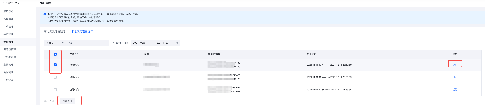
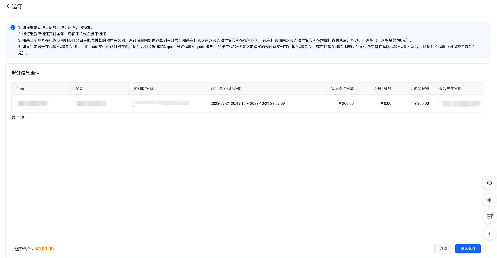
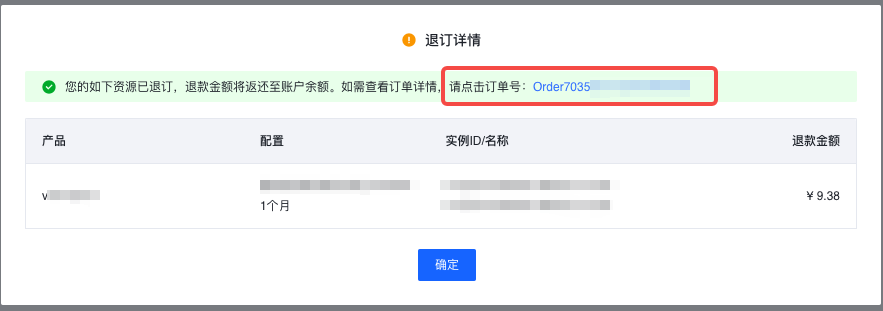

# 退订规则说明

## 退订规则概述

**预付费退订**：火山引擎控制台-费用中心-退订管理仅支持退订预付费实例，支持七天无理由全额退订、非七天无理由退订两种退订类型。退款仅指用户以现金方式支付的订单金额（包含信控额度），不包含代金券抵扣的部分，退订成功后退款金额将退还至账户余额或原路退还，具体参考[退款资金流向](退款资金流向.md)。如您有产品退订需求，可登录火山引擎控制台-费用中心-退订管理进行操作。

**后付费退订**：若您有账号注销或将账户余额全部提现的需求，请前往产品控制台或发起工单完成您账号下后付费服务的退订流程。

注：如退款金额已开票，您应按照我们的要求准备退票相关的资料, 通过火山引擎控制台-费用中心-发票管理或其他火山引擎支持的方式提交退票申请，并在提交退订申请时将退票相关的资料提供给我们，我们审核确认无误后进行款项的退还。

## 一、七天无理由退订说明

### 七天无理由退订规则

1. 支持七天无理由退订的包年包月产品，在新购7天内，可申请无理由全额退款。
2. 支持七天无理由退订的资源包产品，在新购7天内且未使用，可申请无理由全额退款，已使用资源包则不支持7天无理由退订。
3. 新购7天内进行过续费、更配、预留实例调整操作，不支持七天无理由全额退款。
4. 每个账号每个产品每个自然年（1月1日-12月31日）默认可七天无理由全额退订1个实例。
5. 已过期的实例不支持退订。
6. 存在强绑定关系的实例须整体退订。
7. 参与活动购买的产品，若产品退订规则与活动规则冲突，以活动规则为准。
8. 在托管期间购买且由主账号付款的预付费实例，退订后剩余价值将退款到主账号；在托管之前购买的预付费实例在托管期间，或在托管期间购买的预付费实例在解除托管关系后，均退订不退款。
9. 在代销、代售关系建立之前购买的预付费实例，在代销、代售期间仅支持退订实例但不退款；在代销、代售期间购买的预付费实例，解除关系后仅支持退订实例但不退款。
10. 若您的签约主体变更（订单的Seller账号），则签约主体变更后存量实例仅支持退订但不退款。

### 支持七天无理由退订产品

**新购包年包月产品**：公网IP、NAT网关、VPN连接、负载均衡（不包含独占集群）、云企业网、高级网络威胁检测系统、大数据研发治理套件、飞连公有云版、ByteHouse-云数仓版-SaaS、全域数据集成、TrafficRoute解析调度套件-云解析（DNS）、共享带宽包、中转路由器跨境带宽、中转路由器跨域带宽、扣子，具体可退订的包年包月规格以产品规则为准。

**新购资源包**：对象存储、内容分发网络、视频点播、实时音视频、veImageX、业务风险识别、容器服务 VCI 资源包、智能处理、TrafficRoute解析调度套件-移动解析（HTTPDNS）、共享流量包、中转路由器，具体可退订的资源包规格以产品规则为准。

注：除上述产品外，其他包年包月或资源包产品暂不支持七天无理由退订。

> **说明**
> 1. veImageX：每个账号每个自然年可七天无理由全额退订10个资源包。
> 2. 视频点播：每个账号每个自然年可七天无理由全额退订10个资源包。
> 3. 实时音视频：每个账号每个自然年可七天无理由全额退订20个资源包。
> 4. 智能处理：每个账号每个自然年累计可七天无理由全额退订10个资源包。
> 5. TrafficRoute解析调度套件-云解析（DNS） ：每个账号每个自然年累计可七天无理由全额退订10个实例。
> 6. TrafficRoute解析调度套件-移动解析（HTTPDNS）：每个账号每个自然年累计可七天无理由全额退订10个资源包。
> 7. 共享流量包：每个账号每个自然年可七天无理由全额退订10个资源包。
> 8. 中转路由器：每个账号每个自然年可七天无理由全额退订10个资源包。
> 9. 容器服务 VCI 资源包：每个账号每个自然年累计可七天无理由全额退订5个资源包。
> 10. 大数据研发治理套件：每个账号每个自然年累计可七天无理由全额退订3个实例。
> 11. 其余产品：每个账号每个产品每个自然年仅支持七天无理由全额退订1个实例。

## 二、非七天无理由退订说明

### 支持非七天无理由退款产品

**包年包月产品**：云服务器、弹性块存储、镜像服务、云数据库 MySQL 版、云数据库 PostgreSQL 版、缓存数据库 Redis 版、云数据库RDS SQL Server 版、文档数据库 MongoDB 版、表格数据库 HBase 版、云数据库 veDB MySQL 版、消息队列 RabbitMQ版、消息队列 RocketMQ版、消息队列 Kafka版、云搜索服务、机器学习平台、公网IP、负载均衡、NAT网关、VPN连接、云企业网、专线连接、全站加速、云手机、云游戏、ByteHouse企业版、ByteHouse-云数仓版-SaaS、数据库传输服务、高级网络威胁检测系统、飞连公有云版、云调度 GTM、直播SDK、多云CDN、安全托管服务、边缘计算节点、共享带宽包、中转路由器跨境带宽、中转路由器跨域带宽、云原生消息引擎、E-MapReduce-Serverless、扣子（版本与周期型资源包），其它产品暂不支持非7天无理由退订。

### 非七天无理由退订规则

1. 退款计算公式：退订退款金额 = 订单真实价值－已使用金额

> **说明**
> 退订退款金额共有以下三种不同计算方式，具体适用规则云产品计费文档为准。
> 1. 退订退款金额=订单真实价值－购买时的月刊例价 * [ 使用时长（日）/（365/12）]*适用折扣 * [ 订单真实价值 /（订单真实价值+代金券抵扣金额）] * 云产品退订系数
> 2. 退订退款金额=订单真实价值－（订单真实价值-购买时的月刊例价 * [ 使用时长（日）/（365/12）]*适用折扣 * [ 订单真实价值 /（订单真实价值+代金券抵扣金额）] ）* 云产品退订系数
> 3. 退订退款金额=订单真实价值－订单真实价值 * 已抵扣用量 / 总用量
> 4. 名词解释：
>    - a. 刊例价：即火山引擎官网以及有关对客文件中声明的、未配置/参与任何优惠政策或活动的销售价格。
>    - b. 使用时长：指订单的实际消费时长，使用时长=退款时间-订单开始时间，使用时长精确到自然日，不满一个自然日按1天计算。
>    - c. 适用折扣：根据实际使用时长匹配下单时该时长对应的折扣。如下单时规则为满1个月9折、满6个月8折，实际使用时长为2个月，仅可匹配1个月的折扣，即退订时适用折扣为9折。
>    - d. 订单真实价值：指客户实际支付金额，即以现金或信控方式实际支付的全部金额。

5. 订单真实价值：指客户实际支付金额，即以现金或信控方式实际支付的全部金额

> **说明**
> - 新购、续费、预留实例调整订单真实价值为订单实付金额。
> - 更配后实例的真实价值：用于再次更配真实价值计算及退款剩余价值计算。
>   - 更配后实例的真实价值=本次更配应付汇总金额+老配置真实剩余价值。
>   - 老配置真实剩余价值=min{老配置理论剩余价值，老配置原订单真实剩余价值}。
>   - 老配置原订单真实剩余价值=原订单真实价值*（原订单剩余时长/原订单购买时长），时长精确到秒。

3. 已过期的实例不支持退订。
4. 存在强绑定关系的实例须整体退订。
5. 参与活动购买的产品，若产品退订规则与活动规则冲突，以活动规则为准。
6. 在托管期间购买且由主账号付款的预付费实例，退订后剩余价值将退款到主账号；在托管之前购买的预付费实例在托管期间，或在托管期间购买的预付费实例在解除托管关系后，均退订不退款。
7. 在代销、代售关系建立之前购买的预付费实例，在代销、代售期间仅支持退订实例但不退款；在代销、代售期间购买的预付费实例，解除关系后仅支持退订实例但不退款。
8. 若您的签约主体变更（订单的Seller账号），则签约主体变更后存量实例仅支持退订但不退款。
9. 仅部分产品支持已使用资源包退订，其中周期型资源包仅可退下个重置周期及后续周期的费用。
10. 各商品非7天无理由退订退款计算规则如下：

| 产品名称 | 退订退款金额计算公式 |
|----------|----------------------|
| 云服务器（包年包月）、云服务器（预留实例券）、弹性块存储（包年包月）、镜像服务、云数据库 MySQL 版、云数据库 PostgreSQL 版、缓存数据库 Redis 版、云数据库RDS SQL Server 版、文档数据库 MongoDB 版、表格数据库 HBase 版、云数据库 veDB MySQL 版、消息队列 RabbitMQ版、消息对列 RocketMQ版、消息队列 Kafka版、云搜索服务、ByteHouse-云数仓版-SaaS、边缘计算节点、数据库传输服务 | 使用时长<30天：退订退款金额=订单真实价值-购买时的月刊例价 * [ 使用时长（日）/（365/12）]*适用折扣*1.5 * [ 订单真实价值 /（订单真实价值+代金券抵扣金额）] 使用时长>=30天：退订退款金额=订单真实价值-购买时的月刊例价 * [ 使用时长（日）/（365/12）]*适用折扣 * [ 订单真实价值 /（订单真实价值+代金券抵扣金额）] |
| 公网IP、负载均衡（仅小型&中型&大型规格）、NAT网关、VPN连接、云企业网、专线连接（仅物理专线，不包含上云服务）、共享带宽包、中转路由器跨境带宽、中转路由器跨域带宽 | 退订退款金额=订单真实价值-购买时的月刊例价 * [ 使用时长（日）/（365/12）]*适用折扣*1.15 * [ 订单真实价值 /（订单真实价值+代金券抵扣金额）] |
| 负载均衡（超大型规格）、全站加速、云手机、云游戏、字节跳动大模型服务（豆包大模型）、开源LLM模型 | 退订退款金额=订单真实价值-购买时的月刊例价 * [ 使用时长（日）/（365/12）]*适用折扣*1.5 * [ 订单真实价值 /（订单真实价值+代金券抵扣金额）] |
| 机器学习平台（包月）、ByteHouse企业版、高级网络威胁检测系统、飞连公有云版、云调度 GTM、直播SDK、多云CDN、安全托管服务、云原生消息引擎、E-MapReduce-Serverless、扣子（版本与周期型资源包） | 退订退款金额=订单真实价值-购买时的月刊例价 * [ 使用时长（日）/（365/12）]*适用折扣 * [ 订单真实价值 /（订单真实价值+代金券抵扣金额）] |
| 机器学习平台（包天） | 退订退款金额=订单真实价值-购买时的天刊例价 * [ 使用时长（日）]*适用折扣 * [ 订单真实价值 /（订单真实价值+代金券抵扣金额）] |
| 负载均衡（独占集群） | 退订退款金额=【订单真实价值-购买时的月刊例价 * [ 使用时长（日）/（365/12）]*适用折扣 * [ 订单真实价值 /（订单真实价值+代金券抵扣金额）] 】*0.5 |
| 弹性块存储（预留块存储容量包） | 退订退款金额 = 订单真实价值 - 订单真实价值 * 已抵扣用量 / 总用量 |

- **特殊说明**：
  - 非7天无理由退订退款时，使用时长指订单的实际消费时长，使用时长=退款时间-订单开始时间，使用时长精确到自然日，不满一个自然日按1天计算。
  - 适用折扣：根据实际使用时长匹配原订单下单时该时长对应的折扣。
  - 云服务器-预留实例券调整时，原券剩余价值计算规则如下：
    - 使用时长<30天：原券剩余价值=订单真实价值-已使用金额=订单真实价值-购买时的月刊例价 * [ 使用时长（日）/（365/12）]*适用折扣* [ 订单真实价值 /（订单真实价值+代金券抵扣金额）] * 1.5
    - 使用时长>=30天：原券剩余价值=订单真实价值-已使用金额=订单真实价值-购买时的月刊例价 * [ 使用时长（日）/（365/12）]*适用折扣* [ 订单真实价值 /（订单真实价值+代金券抵扣金额）]
    - 在计算预留实例券的剩余价值时，原券的使用时长计算至调整前一自然日，调整当天（自然日）为新券的使用时长。

- **举例说明**

客户于2021/11/02 购买了一个消息队列 RabbitMQ版包月实例，购买时长为6个月，月刊例价为100.00元，满6个月8折，订单原价为600.00元，折后价为480.00元，应付金额为480.00元，代金券抵扣100.00元，现金支付380.00元，实例的到期时间为2022/05/02。客户于2021/11/06 对上述实例进行退订（非7天无理由退订），实际使用时长为5天（11月2日至11月6日共5个自然日），则：

退订退款金额=订单真实价值-购买时的月刊例价 * [ 使用时长（日）/（365/12）]*适用折扣*[ 订单真实价值/（订单真实价值+代金券抵扣金额）] * 1.5=380 - 100 * [5 /（365/12）]*1* [380/（380+100）] *1.5=360.48

## 三、不可退订

- 临时升配期间的实例不支持退订。

## 四、操作步骤

1. 进入"费用中心-退订管理"页面。
2. 选中"可七天无理由退订或非七天无理由退订"页签。
3. 根据实际情况可退订单个实例或批量退订实例。
   - **退订单个实例**：选中待退订实例，单击"退订"按钮，进入"退订信息确认"页面。
   - **批量退订**：在退订列表中勾选待退订实例（多个），单击列表左下方的"批量退订"按钮，进入"退订信息确认"页面。

4. 退订信息确认：可查看所退实例的可退款金额，勾选退订前的确认提示后（如有），单击"确认退订"。

5. 退订详情：退订申请成功，单击"订单号"可跳转至退订订单详情页。

---
最近更新时间：2025.10.13 15:34:29
